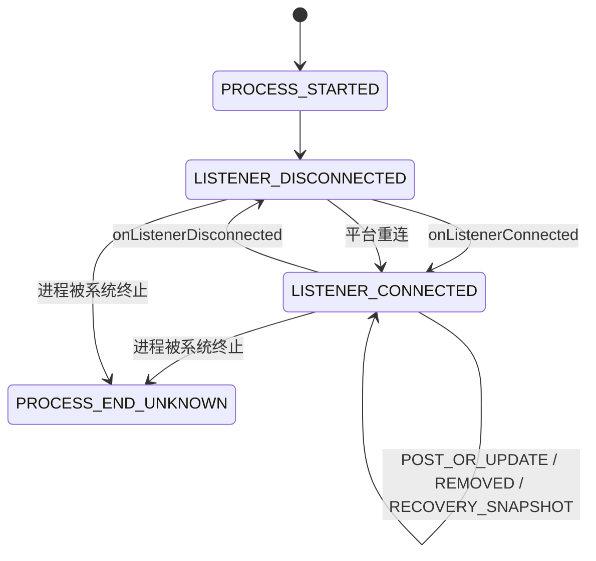
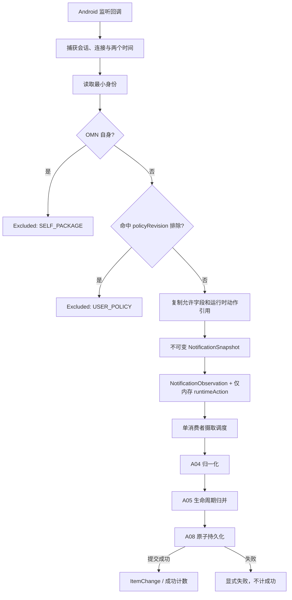

# A03 通知事件采集规格说明

- **主交付版本**：`v0.1`
- **优先级**：`[A]`
- **规格状态**：`[候选] plan-v1.0`
- **Phase 0 依赖**：`SP-01 真实通知字段与生命周期`、`SP-04 摄取队列、事务与归并`、`SP-05 监听可靠性与红魔后台策略`
- **直接依赖**：`A01 首次授权与全量监听` 提供通知使用权和监听连接；`MonitoringPolicySnapshot` 提供采集决策
- **被依赖**：`A04 条目归一化`、`A05 更新合并与去重`、`A08 本地持久化`、`A10 常驻状态通知`、`A11 健康状态时间轴`、`A13 B 站端到端真机验收`、`A14 性能基线与回归门槛`

## 1. 目标与范围

`[已确认]` 本功能负责把 Android `NotificationListenerService` 的连接、发布或更新、移除和重连补扫观察，转换为不再依赖 framework 可变对象的最小不可变输入，并可靠交给摄取链路。

`[已确认]` 采集成功的定义不是“回调已进入内存队列”，而是 A08 返回事务提交成功。A03 不直接增加“已记录”计数，不直接刷新常驻状态通知，也不向 UI 宣称持久化成功。

### 1.1 本功能包含

- `[已确认]` 接收监听连接、断开、通知发布或更新、通知移除和活动通知补扫结果。
- `[已确认]` 在读取标题、正文和动作前自动排除 OMN 自身包名。
- `[候选]` 使用带修订号的 `MonitoringPolicySnapshot` 在回调热路径执行用户排除；`v0.1` 只有自动排除，`A02` 在 `v0.2` 接入用户排除集合。
- `[候选]` 立即记录 OMN 观察时间和同进程单调时间，复制身份、最小可见文本和动作能力。
- `[已确认]` 把 `PendingIntent` 仅作为当前进程内的 `runtimeAction` 传给后续运行时边界，不序列化、不持久化。
- `[候选]` 把监听生命周期事实送入健康证据链路，把通知观察送入单消费者摄取链路。
- `[候选]` 监听重连后获取系统当前仍活动的通知并标为 `RECOVERY_SNAPSHOT`；补扫不承诺找回断连期间已消失的通知。

### 1.2 本功能不包含

- `[排除]` 不判断 `POST_OR_UPDATE` 是新发布还是既有更新；该决策属于 A05。
- `[排除]` 不选择最终标题、正文、占位文案或内容指纹；该决策属于 A04。
- `[排除]` 不访问 Room，不分配 `itemId`、`lifecycleGeneration` 或持久 `ingestSequence`；该决策属于 A05/A08。
- `[排除]` 不执行 `PendingIntent`、URI 或来源应用跳转。
- `[排除]` 不轮询通知栏，不运行周期任务，不持有唤醒锁，不使用精确闹钟。
- `[排除]` 不把 Android `StatusBarNotification`、`Notification`、`Bundle`、`Intent` 或 `PendingIntent` 作为长期领域对象。

## 2. 术语

| 术语 | 精确定义 |
|---|---|
| 观察 | OMN 实际收到一次 Android 回调或主动读取一次活动通知快照；不等同于来源通知首次发布 |
| `runtimeSessionId` | 当前 OMN 进程启动时生成的唯一 ID；进程重建后必须变化 |
| `listenerConnectionId` | 每次 `NotificationListenerService` 成功连接时生成的唯一 ID；断连再连接必须变化 |
| `ObservedCallbackKind` | 回调边界枚举：`POST_OR_UPDATE`、`REMOVED`、`RECOVERY_SNAPSHOT` |
| `NotificationSnapshot` | 从 framework 对象复制出的最小不可变摄取输入；只在当前摄取流程和必要测试中存在 |
| `MonitoringPolicySnapshot` | 原子只读采集策略，包含自动排除、用户排除和 `policyRevision` |
| 补扫 | 监听重连后读取系统当前仍活动通知并重新交给同一摄取链路；不能恢复已经消失的通知 |
| 显式失败 | 回调未能进入可提交链路时生成的分类失败结果；不得被计为已记录 |

## 3. 用户故事

> 作为经常误划通知的用户，我希望系统通知一到达就被 OMN 接住并进入可靠保存链路，以便原通知稍后被划掉时，应用内仍有可核对的记录。

> 作为重视隐私的用户，我希望被排除应用和 OMN 自身的通知在正文与动作被复制前就停止处理，以便这些内容不会进入数据库、日志或诊断事件。

> 作为需要判断漏记风险的用户，我希望监听断开、重连和无法提交的回调都有可解释事实，以便应用不在没有证据时声称一直正常记录。

## 4. 输入契约

### 4.1 `ListenerLifecycleInput`

| 字段 | 逻辑类型 | 必填 | 约束 |
|---|---|---:|---|
| `runtimeSessionId` | `RuntimeSessionId` | 是 | 当前进程内不变；进程重建后新建 |
| `kind` | `ListenerLifecycleKind` | 是 | `LISTENER_CONNECTED` 或 `LISTENER_DISCONNECTED` |
| `listenerConnectionId` | `ConnectionId?` | 条件 | 连接事件新建并必填；断开事件使用当前连接 ID；尚无连接的异常断开可为空 |
| `observedAt` | `InstantUtc` | 是 | 回调入口立即取得的 UTC 时间，不从通知 `postTime` 推断 |
| `observedElapsed` | `MonotonicTime` | 是 | 当前进程内单调时钟，只用于相对顺序 |
| `listenerAccessGranted` | `Boolean` | 是 | 回调时实际读取的通知使用权状态 |

### 4.2 `NotificationCallbackInput`

| 字段 | 逻辑类型 | 必填 | 约束 |
|---|---|---:|---|
| `runtimeSessionId` | `RuntimeSessionId` | 是 | 与当前进程会话一致 |
| `listenerConnectionId` | `ConnectionId` | 是 | 与当前活动监听连接一致；不跨重连复用 |
| `callbackKind` | `ObservedCallbackKind` | 是 | `POST_OR_UPDATE`、`REMOVED` 或 `RECOVERY_SNAPSHOT` |
| `statusBarNotification` | `StatusBarNotification` | 是 | 只允许在回调适配器内读取，不得跨线程或持久化 |
| `removalReason` | `RemovalReason?` | 条件 | `REMOVED` 时系统提供则传入；其他类型必须为空 |
| `observedAt` | `InstantUtc` | 是 | 回调入口立即取得的 UTC 时间 |
| `observedElapsed` | `MonotonicTime` | 是 | 当前进程内单调时钟值 |
| `policy` | `MonitoringPolicySnapshot` | 是 | 同一次决策使用的不可变策略快照 |

### 4.3 `MonitoringPolicySnapshot`

| 字段 | 逻辑类型 | 必填 | 约束 |
|---|---|---:|---|
| `alwaysExcludedPackages` | `Set<PackageName>` | 是 | 必须包含 `io.github.prince_dulb.ohmynotification`，用户不可移除 |
| `userExcludedSources` | `Set<AppUserKey>` | 是 | `v0.1` 为空；A02 接入后可包含 `sourceUser + sourcePackage` |
| `changedAt` | `InstantUtc` | 是 | 本修订成功持久化的时间 |
| `revision` | `StableSequence` | 是 | 每次成功修改递增；与持久策略一致 |

### 4.4 从 framework 复制的 `RawVisibleContent`

| 字段 | 逻辑类型 | 必填 | 来源与约束 |
|---|---|---:|---|
| `title` | `String?` | 否 | 在回调边界从可见标题安全复制成普通字符串；缺失保持空 |
| `text` | `String?` | 否 | 在回调边界从主文本安全复制成普通字符串；缺失保持空 |
| `bigText` | `String?` | 否 | 在回调边界从展开正文安全复制成普通字符串；缺失保持空 |
| `subText` | `String?` | 否 | 在回调边界从子文本安全复制成普通字符串；不自动充当标题 |
| `summaryText` | `String?` | 否 | 在回调边界从摘要安全复制成普通字符串；不自动覆盖正文 |
| `infoText` | `String?` | 否 | 在回调边界从信息文本安全复制成普通字符串 |
| `category` | `String?` | 否 | Android 通知类别；不作为通知身份 |
| `channelId` | `String?` | 否 | 来源渠道 ID；不得当作用户可见来源名 |
| `groupKey` | `String?` | 否 | 系统分组键；只作辅助事实，不单独去重 |

`[候选]` 允许复制字段的最终集合由 `SP-01` 的真实样本矩阵锁定。新增字段必须证明用于归一化、身份反例或精确目标提取；不得原样复制完整 extras。

`[已确认]` framework 提供的 `CharSequence` 只允许在快照工厂的回调边界读取。每个成功字段必须转换为独立 `String` 后才能进入 `RawVisibleContent`；单个可选文本字段读取失败时该字段置空并加入 `copyWarnings`，其余字段和通知身份继续采集。不得把原对象或延迟读取闭包交给 A04。

`SnapshotCopyWarning` 是闭合枚举：`TITLE_COPY_FAILED`、`TEXT_COPY_FAILED`、`BIG_TEXT_COPY_FAILED`、`SUB_TEXT_COPY_FAILED`、`SUMMARY_TEXT_COPY_FAILED`、`INFO_TEXT_COPY_FAILED`。它只表示哪个允许字段无法转成普通字符串，不保存异常原文或字段内容。

### 4.5 `ActionCapabilitySet`

| 字段 | 逻辑类型 | 必填 | 约束 |
|---|---|---:|---|
| `hasContentIntent` | `Boolean` | 是 | 仅说明回调时存在内容动作，不保存令牌 |
| `contentIntentCreatorPackage` | `PackageName?` | 否 | framework 可安全提供时复制；不得用作通知身份 |
| `notificationActionCount` | `NonNegativeInt` | 是 | 通知动作数量摘要；v0 不复制动作标题和 RemoteInput 内容 |
| `hasDeleteIntent` | `Boolean` | 是 | 仅能力摘要；v0 不执行或持久化删除动作 |

`[已确认]` `ActionCapabilitySet` 不包含 `PendingIntent`、动作标签、完整 URI、`Intent` 或其他可执行载荷。

## 5. 输出契约

### 5.1 `NotificationSnapshot`

| 字段 | 逻辑类型 | 必填 | 生成规则 |
|---|---|---:|---|
| `runtimeSessionId` | `RuntimeSessionId` | 是 | 原样传递 |
| `listenerConnectionId` | `ConnectionId` | 是 | 原样传递 |
| `callbackKind` | `ObservedCallbackKind` | 是 | 原样传递，不在 A03 细分新发/更新 |
| `identity.sourcePackage` | `PackageName` | 是 | 从 `StatusBarNotification` 读取；空或非法时失败隔离 |
| `identity.sourceUser` | `AndroidUserRef` | 是 | 从 Android 用户上下文读取；不得只用包名代替 |
| `identity.systemKey` | `String` | 是 | 从系统通知 key 读取；不承诺跨重启永久唯一 |
| `identity.notificationId` | `Int` | 是 | 从系统通知读取 |
| `identity.tag` | `String?` | 否 | 原样复制；空值合法 |
| `identity.lifecycleGeneration` | `NonNegativeInt?` | 否 | A03 必须输出空，由 A05 分配 |
| `postTime` | `InstantUtc` | 是 | 由系统 `postTime` 转为 UTC；不替换为 `observedAt` |
| `observedAt` | `InstantUtc` | 是 | 回调入口时间 |
| `observedElapsed` | `MonotonicTime` | 是 | 回调入口单调时间 |
| `content` | `RawVisibleContent` | 是 | `REMOVED` 时所有文本字段为空；其他类型复制允许字段 |
| `copyWarnings` | `Set<SnapshotCopyWarning>` | 是 | 无字段复制失败时为空；`REMOVED` 必须为空 |
| `actionCapabilities` | `ActionCapabilitySet` | 是 | 只描述是否观察到内容动作等能力，不包含动作令牌 |
| `runtimeAction` | `PendingIntent?` | 否 | 仅当前进程内传递；`REMOVED` 时为空 |
| `policyRevision` | `StableSequence` | 是 | 做采集决策时使用的策略修订 |
| `removalReason` | `RemovalReason?` | 否 | 仅 `REMOVED` 可有值 |

### 5.1.1 `NotificationObservation`（纯数据投影）

`[候选]` 摄取协调器在排队前把 `NotificationSnapshot` 拆成纯数据 `NotificationObservation` 与仅内存 `runtimeAction`。前者字段固定为下表，供 A04/A05 使用；后者只随 `observationId` 留在当前摄取流程，提交后才可按 `itemId` 注册。

| 字段 | 逻辑类型 | 必填 | 生成规则 |
|---|---|---:|---|
| `runtimeSessionId` | `RuntimeSessionId` | 是 | 原样投影 |
| `listenerConnectionId` | `ConnectionId` | 是 | 原样投影 |
| `callbackKind` | `ObservedCallbackKind` | 是 | 原样投影 |
| `identity` | `NotificationIdentity` | 是 | 原样投影，`lifecycleGeneration=null` |
| `postTime` | `InstantUtc` | 是 | 原样投影 |
| `observedAt` | `InstantUtc` | 是 | 原样投影 |
| `observedElapsed` | `MonotonicTime` | 是 | 原样投影 |
| `content` | `RawVisibleContent` | 是 | 只含独立普通字符串和小型辅助字段 |
| `copyWarnings` | `Set<SnapshotCopyWarning>` | 是 | 原样投影 |
| `actionCapabilities` | `ActionCapabilitySet` | 是 | 原样投影，不含可执行载荷 |
| `policyRevision` | `StableSequence` | 是 | 原样投影 |
| `removalReason` | `RemovalReason?` | 否 | 原样投影 |

`[排除]` `NotificationObservation` 不含 `runtimeAction`、`PendingIntent`、`Intent`、`Parcel` 或 framework 容器。A04/A05 的纯规则接口不允许接收完整 `NotificationSnapshot`。

### 5.2 `CaptureDispatchResult`

| 变体 | 字段 | 含义 |
|---|---|---|
| `Enqueued` | `observationId: ObservationId`、`policyRevision: StableSequence`、`enqueuedAt: InstantUtc` | 快照已进入摄取调度；不是持久化成功 |
| `Excluded` | `reason: ExclusionReason`、`policyRevision: StableSequence`、`observedAt: InstantUtc` | `SELF_PACKAGE` 或 `USER_POLICY`；不含正文、动作和内容指纹 |
| `Failed` | `failureId: FailureId`、`errorCode: CaptureErrorCode`、`observedAt: InstantUtc` | 未能形成或提交快照；不得更新成功计数 |

`ObservationId` 只在当前摄取流程中关联排队与提交结果，不是通知身份；`FailureId` 是不含来源内容的随机关联 ID。

`[已确认]` 用户可见“已记录”只能消费 A08 的 `CommitResult`，不得消费 `Enqueued`。

### 5.3 `HealthEvidenceCandidate`

| 字段 | 逻辑类型 | 必填 | 说明 |
|---|---|---:|---|
| `runtimeSessionId` | `RuntimeSessionId` | 是 | 当前进程会话 |
| `listenerConnectionId` | `ConnectionId?` | 条件 | 监听相关事实使用当前连接 ID |
| `kind` | `HealthEvidenceKind` | 是 | `LISTENER_CONNECTED`、`LISTENER_DISCONNECTED`、`NOTIFICATION_CALLBACK` 或 `RECOVERY_COMPLETED` |
| `occurredAt` | `InstantUtc` | 是 | UTC 时间 |
| `occurredElapsed` | `MonotonicTime?` | 否 | 同进程顺序校验 |
| `facet` | `HealthFacet` | 是 | 本功能只输出 `LISTENER` 或 `PROCESS` |
| `value` | `HealthFactValue` | 是 | 离散事实，不含通知正文 |

## 6. 状态机

- `[候选]` `PROCESS_END_UNKNOWN` 没有可执行回调，不伪造终止时间；下次进程启动使用新的 `runtimeSessionId`，A11 将证据间隙派生为未确认运行。
- `[候选]` 只有处于当前 `LISTENER_CONNECTED` 的回调才能使用当前 `listenerConnectionId`。若平台交付顺序与该假设冲突，保存分类失败事实并由 `SP-05` 决定兼容规则。

## 7. 处理规则顺序

对每个 `NotificationCallbackInput` 严格按以下顺序处理：

1. `[候选]` 捕获 `observedAt`、`observedElapsed`、`runtimeSessionId` 和 `listenerConnectionId`；不得在后续异步任务启动时才取时间。
2. `[候选]` 读取身份最小字段：`sourcePackage`、`sourceUser`、`systemKey`、`notificationId`、`tag`。身份无法安全读取时输出 `Failed(INVALID_IDENTITY)`，隔离该条并继续后续回调。
3. `[已确认]` 若 `sourcePackage` 为 OMN 自身，立即输出 `Excluded(SELF_PACKAGE)`；不得读取或复制正文、动作、完整 extras。
4. `[候选]` 以 `sourceUser + sourcePackage` 查询本次不可变策略快照；命中用户排除时输出 `Excluded(USER_POLICY)`，同样不得复制正文或动作。
5. `[候选]` 对 `REMOVED` 只复制身份、时间和移除原因，`content` 为空且 `runtimeAction` 为空。
6. `[候选]` 对 `POST_OR_UPDATE` 和 `RECOVERY_SNAPSHOT` 在回调内逐字段把允许的可见 `CharSequence` 安全转换成独立 `String`；某个可选字段失败则置空并记录对应 `SnapshotCopyWarning`，不牺牲其余字段。随后复制动作能力和当前进程 `runtimeAction` 引用；不复制大图、位图、完整 extras 或任意 `Intent`。
7. `[候选]` 构造不可变 `NotificationSnapshot`，清除所有 framework 容器引用；调度器立即投影纯数据 `NotificationObservation`，并把 `runtimeAction` 仅随当前 `observationId` 暂存在内存，绝不传给 A04/A05。
8. `[已确认]` 调度器不得静默丢弃。入队失败必须输出 `Failed(INGESTION_BACKPRESSURE)`；队列容量和退让方式由 Phase 0 锁定。
9. `[候选]` 生成 `NOTIFICATION_CALLBACK` 健康证据候选；只有与通知事务共同提交或有明确独立失败记录后，才成为持久事实。
10. `[已确认]` 等待 A08 提交结果后，才允许向状态摘要链路发布 `ItemChange` 或成功计数。

### 7.1 排除策略并发边界

- `[候选]` A02 修改排除策略时，先持久化新策略，再原子发布新 `MonitoringPolicySnapshot`，最后向 UI 返回成功。
- `[候选]` UI 返回成功前已经按旧 `policyRevision` 接纳的回调继续按旧决策处理；UI 返回成功后的新回调必须使用新修订。
- `[已确认]` 策略修订只决定未来采集，不删除或改写既有条目。

## 8. Given / When / Then 验收条件

1. **普通通知采集**：
   Given 通知使用权已授予、监听已连接且来源未排除，When Android 交付一次 `onNotificationPosted`，Then A03 输出一个字段完整的 `POST_OR_UPDATE` 快照，并最终可与 A08 的提交结果一一对账。

2. **自动排除自身**：
   Given 来源包名为 `io.github.prince_dulb.ohmynotification`，When OMN 的状态通知触发监听回调，Then 输出 `Excluded(SELF_PACKAGE)`，且测试钩子证明标题、正文、动作和内容指纹均未复制或持久化。

3. **用户排除**：
   Given A02 已成功发布包含来源 X 的策略修订 12，When X 的下一条通知以 `policyRevision=12` 到达，Then 输出 `Excluded(USER_POLICY)`，数据库中没有该通知的正文、动作、指纹或来源内容事件。

4. **策略切换竞态**：
   Given 回调 A 已按修订 11 入队且随后修订 12 排除该来源，When A 在修订 12 成功后才提交，Then A 仍保留 `policyRevision=11` 并按旧决策处理；修订 12 成功后的回调 B 必须被排除。

5. **移除事件最小化**：
   Given 系统通知已存在，When Android 交付 `onNotificationRemoved`，Then 快照保留身份、观察时间和移除原因，所有文本和 `runtimeAction` 为空。

6. **断连与重连**：
   Given 当前连接 ID 为 C1，When 监听断开后重连，Then 持久健康候选依次包含 C1 的断开和新连接 C2，C2 不等于 C1。

7. **补扫重放**：
   Given 重连后系统仍有一条活动通知，When A03 执行活动通知补扫，Then 输出 `RECOVERY_SNAPSHOT`，后续 A05 可识别已存在活动代次而不创建重复条目。

8. **缺少可见字段**：
   Given 通知标题、正文、子文本和动作均为空，When 回调到达，Then A03 仍输出身份和时间有效的快照，不伪造文字、不崩溃。

9. **排队不是成功**：
   Given 快照已返回 `Enqueued`，When 随后的 Room 事务失败，Then “已记录”计数不增加，状态页能看到分类持久化失败，而不是采集成功。

10. **突发不丢弃**：
    Given 版本化数据集连续交付 100 个已知回调，When 摄取链路出现积压，Then 每个回调最终对应 `Committed`、`Excluded` 或 `Failed` 之一，无无记录的队列溢出。

11. **进程终止窗口**：
    Given 回调已进入调度但事务尚未提交，When 强制终止 OMN 进程，Then 重启后不会出现半条数据或成功计数；该回调若无法恢复，测试报告明确记录为未提交失败窗口而非已记录。

12. **framework 对象不穿透**：
    Given 回调返回后原 `Bundle` 或 `StatusBarNotification` 发生变化，When 后续归一化执行，Then结果只取决于回调内复制的快照，不随原对象变化。

13. **单个可选文本字段读取失败**：
    Given `bigText` 转字符串时抛出异常而 `text` 可正常复制，When A03 构造快照，Then `bigText=null`、`text` 保留、`copyWarnings` 含 `BIG_TEXT_COPY_FAILED`，该观察仍进入摄取链路且不保留原 `CharSequence`。

## 9. 边界条件

| 边界 | 必须行为 |
|---|---|
| 标题、正文、动作或 tag 为空 | 保留空值；只要身份可读就继续，不生成虚假文字 |
| `postTime` 为极端值 | 原值转为 `InstantUtc` 后交 A04 判断显示有效性；不得用 `observedAt` 冒充来源时间 |
| 文本超长或含异常字符 | A03 只做安全副本；A04 按锁定限制归一化和透明截断，单条异常不能终止监听 |
| 多线程或重入回调 | 每次生成独立不可变快照；摄取协调器按观察顺序单消费者处理 |
| 100 条以上突发 | 不静默丢弃；容量、背压和最大积压由 Phase 0 量化 |
| 同一回调被平台重放 | A03 如实输出第二次观察；A05 决定是否只更新事件而不新增条目 |
| 回调期间策略变化 | 使用回调开始时捕获的 `policyRevision`，不在处理中途切换策略 |
| 进程终止 | 只承认已提交事务；内存快照和 `PendingIntent` 引用可丢失，不伪造已保存 |
| 网络断开 | 采集链路行为不变；A03 不联网 |
| 存储不足 | A03 可继续形成快照，但 A08 必须返回明确失败；不得累积无界内存等待 |
| 监听权限被撤销 | 记录权限与断连事实，停止声称正在监听；保留既有数据 |
| OMN 自身通知递归 | 在正文与动作复制前排除，不产生通知条目 |

## 10. 错误状态

| 错误码 | 触发条件 | 用户可见结果 | 系统行为 |
|---|---|---|---|
| `LISTENER_ACCESS_MISSING` | 通知使用权未授予或已撤销 | “未在监听”，提供系统设置入口 | 不声称记录新通知；保留既有数据和健康事实 |
| `INVALID_IDENTITY` | 包名、用户或系统 key 无法安全读取 | 健康页显示某时刻存在一条无法识别的回调 | 不复制正文和动作；隔离该条，继续监听 |
| `SNAPSHOT_COPY_FAILED` | 必填快照结构无法复制，或快照无法在安全资源边界内构造 | “一条通知采集失败”，不显示敏感原文 | 保存去内容失败枚举；继续后续通知；单个可选文本字段失败不触发本错误 |
| `INGESTION_BACKPRESSURE` | 摄取调度无法接纳且没有已验证的背压路径 | 显示受影响时间和可能漏记 | 不静默丢弃；记录计数，停止成功摘要 |
| `PERSISTENCE_FAILED` | A08 返回事务失败 | “该条可能未保存”，显示存储修复入口 | 不增加成功计数；不无限重试 |
| `RECOVERY_SNAPSHOT_FAILED` | 重连后无法读取活动通知 | 显示重连成功但补扫未完成 | 保留连接与失败事实，不宣称找回断连窗口 |
| `UNKNOWN_CAPTURE_FAILURE` | 未分类异常 | 显示采集异常和最后确认时间 | 最小化记录枚举，隔离单条，禁止崩溃循环 |

## 11. 数据流

### 11.1 交互边界

- `[已确认]` A03 没有可直接操作的界面；授权入口属于 A01，排除编辑属于 A02。
- `[已确认]` 常驻通知、健康页和收件箱只消费提交后事实或分类失败，不显示 `Enqueued` 为成功。
- `[候选]` `LISTENER_ACCESS_MISSING`、积压和持久化失败通过不含来源内容的状态模型映射为用户文案；点击修复入口只能打开对应系统设置或本地设置，不在采集层执行界面导航。

## 12. 隐私与性能约束

### 12.1 隐私

- `[已确认]` 被排除通知不持久化标题、正文、动作、内容指纹或可还原内容的诊断字段。
- `[已确认]` 日志、异常消息和公开测试报告不得包含通知原文、完整 URI、`PendingIntent`、`Intent`、extras、Token 或本机路径。
- `[已确认]` 默认不复制或保存通知大图、位图、媒体和逐条应用图标。
- `[已确认]` A03 无网络、无遥测、无远程心跳。
- `[候选]` 测试跟踪只使用合成样本和去内容内部 ID；真实 B 站样本保存在 Git 未跟踪的本机位置。

### 12.2 性能

- `[已确认]` 回调热路径不访问 Room、不加载图标、不做复杂 URI 解析、不更新 Compose、不执行动作。
- `[已确认]` 无通知时 A03 不运行任何周期工作、轮询、唤醒锁或精确闹钟。
- `[待验证]` 回调复制耗时、队列容量、峰值积压、满载退让和 100 条突发处理预算由 `SP-04` 锁定；绝对资源预算由 `SP-09` 统一写回非功能需求。
- `[已确认]` 不以 `DROP_OLDEST`、`DROP_LATEST` 或忽略 `trySend` 失败降低内存。
- `[候选]` 原始 framework 大对象在快照构造后立即释放引用；只保留最小文本和必要运行时动作。

## 13. 测试要求

### 13.1 自动化测试

- `NotificationSnapshotFactory`：完整字段、全部可空字段、异常 `CharSequence`、超长文本、非法身份和移除事件。
- `MonitoringPolicySnapshot`：自身排除、用户排除、不同 Android 用户、修订切换竞态。
- 回调顺序：发布/更新/移除、断连/重连、补扫重放、同壁钟时间的单调顺序。
- 队列契约：100 条及更高突发下无静默溢出；每个输入有终态结果。
- 进程边界夹具：排队后提交前终止时，没有成功计数和半持久记录。
- 隐私扫描：排除结果和失败日志中不存在标题、正文、动作、完整 URI 或 extras。

### 13.2 集成测试

- 可控通知生产者向真实 `NotificationListenerService` 发送发布、更新、移除和分组通知，逐项核对快照。
- A03→A04→A05→A08 纵向测试：每个未排除输入最终得到提交或显式失败；自身通知不进入 Room。
- 监听重连补扫：活动通知可进入 `RECOVERY_SNAPSHOT`；已消失通知不被伪造恢复。

### 13.3 红魔 11 Pro+ 真机测试

- release 构建覆盖首次授权、撤权、监听断连、平台重连、长时间锁屏、进程回收、开机恢复和厂商后台策略。
- 使用 B 站投稿、动态、开播样本记录实际字段和更新序列；公开结果必须脱敏。
- 8 小时息屏无通知确认没有 A03 主动周期唤醒或数据库写入。
- 100 条突发记录输入数、排除数、提交数、失败数、最大积压、处理耗时、CPU 和峰值 PSS，四类数量必须可对账。

## 14. Phase 0 未决项与决策门

| 未决项 | 必须证据 | `GO` 条件 | 未通过处理 |
|---|---|---|---|
| 实际身份字段和 Android 用户表示 | B 站三类与可控应用字段矩阵 | 每个受支持回调都能形成不依赖标题/正文的最小身份 | `REDIRECT` 身份模型并同步 A05/A08 |
| 监听回调与重连顺序 | 红魔生命周期日志 | 能定义连接 ID、断连和补扫的可复现边界 | 不承诺无法观察的恢复行为 |
| 快照允许字段集合 | 真实样本用途与隐私审查 | 字段足够归一化和提取目标，且不复制完整 extras | 删除无用途字段或返回架构调整 |
| 摄取队列与背压 | 100 条以上突发、进程终止、PSS 和回调耗时 | 无静默丢弃、无主线程长阻塞、内存有界且失败可见 | 重新比较有界背压与单线程执行器，不进入 v0.1 |
| `PendingIntent` 运行时持有 | 划除、等待、进程重建和句柄规模测量 | 只在当前进程安全持有且资源成本可接受 | 不持久化；依赖持久目标或重开跳转边界 |
| 绝对性能预算 | release 真机重复测量 | 回调、积压、CPU、PSS 和写盘预算已写回非功能需求 | Phase 0 保持未完成，不宣称 A03 交付 |

`[已确认]` A03 的 Phase 0 决策门通过前，不得把“监听服务收到过回调”表述为“通知已可靠保存”。
