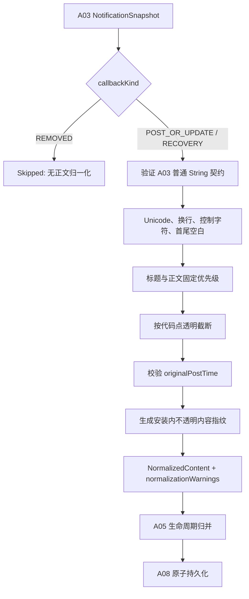

# A04 条目归一化规格说明

- **主交付版本**：`v0.1`
- **优先级**：`[A]`
- **规格状态**：`[候选] plan-v1.0`
- **Phase 0 依赖**：`SP-01 真实通知字段与生命周期`、`SP-04 摄取队列、事务与归并`、`SP-09 持久化、隐私与性能基线`
- **直接依赖**：`A03 通知事件采集` 提供纯数据 `NotificationObservation`
- **被依赖**：`A05 更新合并与去重`、`A06 稳定排序`、`A07 时间窗应用抽屉`、`A08 本地持久化`、`A09 原内容跳转`、`A12 多应用查看筛选`、`A13 B 站端到端真机验收`

## 1. 目标与范围

`[已确认]` 本功能把来源不一致、字段可能缺失的 `NotificationObservation` 纯函数式转换为最小、稳定、可展示的 `NormalizedContent`。同一输入和同一策略版本必须得到完全相同的输出。

`[已确认]` 归一化不创建 `NotificationItem`，不判断通知是否为新生命周期，不执行数据库写入，也不执行任何跳转动作。

### 1.1 本功能包含

- `[候选]` 对 A03 已复制成普通 `String` 的可见文本统一换行、不安全控制字符和空白边界。
- `[候选]` 按固定优先级选择标题和正文，不为缺失字段编造内容。
- `[候选]` 使用具名、版本化的长度限制透明截断异常长字段，并输出警告。
- `[候选]` 对归一化后的标题和正文生成同安装内不透明的 `contentFingerprint`，只用于同一生命周期内判断内容是否变化。
- `[候选]` 保存来源应用标签的小型文本快照；应用图标仍按包名加载，不进入归一化结果。
- `[候选]` 校验来源 `postTime` 是否可用于详情展示；无效时保持 `originalPostTime=null`，不以接收时间替代。

### 1.2 本功能不包含

- `[排除]` 不把标题、正文或 `contentFingerprint` 当作通知身份。
- `[排除]` 不依据包名写 B 站专用正文规则；精确目标提取属于 `BilibiliTargetExtractor`。
- `[排除]` 不写 UI 占位文案。诸如“无标题”“无文本内容”只在界面层按空值派生，不写入长期事实。
- `[排除]` 不保存 Spannable 样式、位图、大图、媒体、完整 extras、`Intent` 或 `PendingIntent`。
- `[排除]` 不联网，不查询 B 站 API，不依赖 locale 格式化后的时间字符串。

## 2. 术语

| 术语 | 精确定义 |
|---|---|
| 原始可见字段 | A03 从通知中允许复制的 `title`、`text`、`bigText`、`subText`、`summaryText`、`infoText` |
| 归一化文本 | 转为 `String`、换行统一、控制字符处理、首尾空白删除并执行长度限制后的文本 |
| 空文本 | 输入为空，或归一化后仅含空白；输出为 `null`，不输出空字符串 |
| 正文候选优先级 | `bigText` → `text` → `summaryText` → `subText` → `infoText` |
| 透明截断 | 按代码点保留前缀至锁定上限，同时输出 `TEXT_TRUNCATED` 和原始代码点数；UI 可明确提示内容被截断 |
| `contentFingerprint` | 对规范标题与正文做同安装内不透明摘要；只比较内容变化，不作跨设备标识或唯一通知 ID |
| 归一化策略版本 | 标识字段优先级、字符规则、限制值和指纹规范的一组版本；同一版本输出必须确定 |

## 3. 用户故事

> 作为用户，我希望无论通知来自 B 站、短信还是系统组件，只要存在可见文字，就能在收件箱看到一致、可理解的标题和正文；字段缺失时应用明确降级而不是崩溃或编造内容。

> 作为用户，我希望异常长或畸形通知不会拖垮后台采集，也不会悄悄改变其他通知；如果内容被截断，应用应当能说明这一事实。

> 作为维护者，我希望归一化规则与 Android 回调、Room 和 Compose 解耦，以便用固定夹具复现内容变化和缺失字段反例。

## 4. 输入契约

### 4.1 `NormalizationInput`

| 字段 | 逻辑类型 | 必填 | 约束 |
|---|---|---:|---|
| `observation` | `NotificationObservation` | 是 | A03 的纯数据投影；不含 `runtimeAction` 或任何 framework 类型 |
| `sourceLabelCandidate` | `String?` | 否 | 由独立来源元数据适配器在进入 A04 前复制为普通字符串；无法解析时为空，不使用包名伪装标签 |
| `limits` | `NormalizationLimits` | 是 | Phase 0 锁定的具名长度与时间校验配置 |
| `normalizationStrategyVersion` | `NormalizationStrategyVersion` | 是 | 结果必须记录使用的版本 |
| `fingerprintContext` | `FingerprintContext` | 是 | 当前安装的私有不透明摘要上下文；不得进入日志、导出或 Git |

### 4.2 使用的 `NotificationObservation` 字段

| 字段 | 逻辑类型 | 必填 | 用途 |
|---|---|---:|---|
| `callbackKind` | `ObservedCallbackKind` | 是 | `REMOVED` 不进行正文归一化 |
| `postTime` | `InstantUtc` | 是 | 校验后映射为 `originalPostTime` |
| `observedAt` | `InstantUtc` | 是 | 只用于校验来源时间，不替代来源时间 |
| `content.title` | `String?` | 否 | A03 的独立普通字符串；唯一标题候选 |
| `content.text` | `String?` | 否 | A03 的独立普通字符串；正文候选 2 |
| `content.bigText` | `String?` | 否 | A03 的独立普通字符串；正文候选 1 |
| `content.summaryText` | `String?` | 否 | A03 的独立普通字符串；正文候选 3 |
| `content.subText` | `String?` | 否 | A03 的独立普通字符串；正文候选 4 |
| `content.infoText` | `String?` | 否 | A03 的独立普通字符串；正文候选 5 |
| `copyWarnings` | `Set<SnapshotCopyWarning>` | 是 | A03 的可选文本复制失败集合；不含原文 |
| `actionCapabilities` | `ActionCapabilitySet` | 是 | 原样传给归一化结果摘要；不含动作令牌 |

### 4.3 `NormalizationLimits`

| 字段 | 逻辑类型 | 必填 | 约束 |
|---|---|---:|---|
| `maxTitleCodePoints` | `PositiveInt` | 是 | Phase 0 依据真实样本、Binder 风险和数据库增长锁定 |
| `maxBodyCodePoints` | `PositiveInt` | 是 | Phase 0 锁定；不得与标题上限共用魔法数字 |
| `maxSourceLabelCodePoints` | `PositiveInt` | 是 | Phase 0 锁定 |
| `minimumAcceptedPostTime` | `InstantUtc` | 是 | 早于该值的来源时间输出为空并警告 |
| `maxFuturePostTimeSkew` | `Duration` | 是 | `postTime > observedAt + skew` 时输出为空并警告；数值由 Phase 0 锁定 |

`[待验证]` 上述绝对数值在 Phase 0 前不编造。没有锁定配置时只能运行 Spike/测试模式，不得宣称生产归一化已交付。

## 5. 输出契约

### 5.1 `NormalizationResult`

| 变体 | 字段 | 含义 |
|---|---|---|
| `Normalized` | `content: NormalizedContent` | 发布、更新或补扫快照已成功归一化 |
| `Skipped` | `reason: NormalizationSkipReason` | 当前唯一值为 `REMOVAL_HAS_NO_CONTENT`；A05 仍处理生命周期 |
| `Failed` | `failureId: FailureId`、`errorCode: NormalizationErrorCode`、`normalizationWarnings: Set<NormalizationWarning>` | 单条输入无法安全转换；不得终止后续通知 |

`FailureId` 是每次失败新生成、不含来源内容的随机关联 ID；它只用于把错误结果与有界本地诊断对应起来，不得充当通知身份或重试键。

### 5.2 `NormalizedContent`

| 字段 | 逻辑类型 | 必填 | 生成规则 |
|---|---|---:|---|
| `title` | `String?` | 否 | 只来自规范化 `content.title`；空文本输出空值 |
| `body` | `String?` | 否 | 按固定正文优先级选第一个非空结果；与标题完全相同时输出空值 |
| `sourceLabelSnapshot` | `String?` | 否 | 规范化 `sourceLabelCandidate`；空时不以包名替代 |
| `originalPostTime` | `InstantUtc?` | 否 | 通过时间规则时为 `snapshot.postTime`，否则为空 |
| `contentFingerprint` | `OpaqueFingerprint?` | 否 | 标题和正文至少一项非空时生成；两者均空则为空 |
| `actionCapabilities` | `ActionCapabilitySet` | 是 | 原样传递能力摘要，不含 `PendingIntent` |
| `normalizationWarnings` | `Set<NormalizationWarning>` | 是 | 无警告时为空集合 |
| `normalizationStrategyVersion` | `NormalizationStrategyVersion` | 是 | 原样记录输入版本 |
| `titleOriginalCodePoints` | `NonNegativeInt` | 是 | 字符规范化完成、截断前的标题代码点数；无标题为 0 |
| `bodyOriginalCodePoints` | `NonNegativeInt` | 是 | 被选中正文字符规范化完成、截断前的代码点数；无正文为 0 |

### 5.3 `NormalizationWarning`

| 枚举值 | 精确定义 |
|---|---|
| `TITLE_MISSING` | 标题不存在或归一化后为空 |
| `BODY_MISSING` | 所有正文候选不存在或归一化后为空 |
| `BODY_DUPLICATES_TITLE` | 选中正文与标题完全相同，正文输出为空 |
| `TITLE_TRUNCATED` | 标题超过 `maxTitleCodePoints`，已保留前缀 |
| `BODY_TRUNCATED` | 正文超过 `maxBodyCodePoints`，已保留前缀 |
| `SOURCE_LABEL_TRUNCATED` | 来源标签超过上限 |
| `SOURCE_TEXT_COPY_FAILED` | A03 至少一个允许文本字段无法复制为普通字符串；可用的其他字段仍继续归一化 |
| `UNSAFE_CONTROL_REPLACED` | 至少一个不允许的控制字符被 U+FFFD 替换 |
| `POST_TIME_REJECTED` | 来源时间早于最小值或超过允许未来偏差，`originalPostTime=null` |

## 6. 文本归一化规则顺序

处理开始时，若 `observation.copyWarnings` 非空，先向结果集合加入一次 `SOURCE_TEXT_COPY_FAILED`；该事实不阻止可用字段继续处理。随后对每个文本候选执行完全相同的 `normalizeText`：

1. `[候选]` 输入为空时返回空值，不进入该字段的后续步骤。
2. `[候选]` 验证输入是 A03 契约规定的独立普通 `String`；A04 不接受 framework `CharSequence`、延迟读取器或可变文本容器。
3. `[候选]` 把 `CRLF` 和单独 `CR` 统一为 `LF`。
4. `[候选]` 保留普通 Unicode、`LF` 和制表符；把 NUL 及除 `LF`/TAB 外的 C0 控制字符替换为 U+FFFD，并记录 `UNSAFE_CONTROL_REPLACED`。
5. `[候选]` 把 TAB 规范为一个普通空格；不折叠正文内部的连续空格和换行。
6. `[候选]` 删除首尾 Unicode 空白。结果为空字符串时返回空值。
7. `[候选]` 按 Unicode 代码点而非 UTF-16 单元应用字段上限，保留前缀；不得切断代理项。

### 6.1 字段选择规则

严格按以下顺序执行：

1. `[候选]` 对 `content.title` 调用 `normalizeText(maxTitleCodePoints)`；不从正文、来源标签或包名推导标题。
2. `[候选]` 依次对 `bigText`、`text`、`summaryText`、`subText`、`infoText` 调用 `normalizeText(maxBodyCodePoints)`，选择第一个非空结果作为正文，选择后不拼接其他候选。
3. `[候选]` 若正文与标题按代码点完全相同，则输出 `body=null` 并记录 `BODY_DUPLICATES_TITLE`，避免长期重复保存同一文本。
4. `[候选]` 对 `sourceLabelCandidate` 使用同一字符规则和 `maxSourceLabelCodePoints`；空值保持为空。
5. `[候选]` 若 `postTime < minimumAcceptedPostTime` 或 `postTime > observedAt + maxFuturePostTimeSkew`，输出 `originalPostTime=null` 和 `POST_TIME_REJECTED`；不以 `observedAt` 替代。
6. `[候选]` 若标题与正文均为空，`contentFingerprint=null`；否则对策略版本、标题和正文的长度前缀编码规范字节做同安装内不透明摘要。

### 6.2 指纹边界

- `[已确认]` `contentFingerprint` 只能在 A05 已确认属于同一系统身份和活动代次后比较。
- `[排除]` 不用相同指纹合并两个不同 `systemKey`、不同来源或不同生命周期代次。
- `[候选]` 指纹使用每安装私有上下文，公开日志和诊断只记录“相同/不同”，不输出摘要值。
- `[待验证]` 摘要算法、上下文存储和策略版本升级行为由 Phase 0 安全与持久化 Spike 锁定。

## 7. Given / When / Then 验收条件

1. **优先使用展开正文**：
   Given `bigText="完整正文"`、`text="短正文"`，When 归一化，Then `body="完整正文"`，不拼接短正文。

2. **展开正文为空时回退**：
   Given `bigText` 仅为空白且 `text="正文"`，When 归一化，Then `body="正文"`。

3. **缺少标题**：
   Given `title=null` 且正文有效，When 归一化，Then `title=null`、正文保留，并包含 `TITLE_MISSING`；数据库不保存“无标题”字样。

4. **全部文本缺失**：
   Given 所有可见文本字段为空，When 归一化，Then `title=null`、`body=null`、`contentFingerprint=null`，同时返回 `TITLE_MISSING` 与 `BODY_MISSING`，不崩溃。

5. **正文重复标题**：
   Given 规范化后的标题和正文完全相同，When 归一化，Then 只保留标题，`body=null`，并返回 `BODY_DUPLICATES_TITLE`。

6. **换行与控制字符**：
   Given 文本含 CRLF、CR、TAB 和 NUL，When 归一化，Then 换行为 LF、TAB 为一个空格、NUL 为 U+FFFD，并返回控制字符警告。

7. **代码点安全截断**：
   Given 正文超过已锁定上限且边界处为补充平面字符，When 归一化，Then 输出不含孤立代理项的前缀，并返回原始代码点数与 `BODY_TRUNCATED`。

8. **来源标签缺失**：
   Given包管理器无法解析标签，When 归一化，Then `sourceLabelSnapshot=null`；UI 可另行显示包名，但长期字段不伪造标签。

9. **来源时间异常**：
   Given `postTime` 超过 `observedAt + maxFuturePostTimeSkew`，When 归一化，Then `originalPostTime=null` 并返回 `POST_TIME_REJECTED`；`firstReceivedAt` 后续仍使用 `observedAt`。

10. **移除观察**：
    Given `callbackKind=REMOVED`，When 调用归一化，Then 返回 `Skipped(REMOVAL_HAS_NO_CONTENT)`，A05 仍能用快照身份关闭生命周期。

11. **确定性**：
    Given 完全相同的输入、限制、指纹上下文和策略版本，When 在不同线程和进程重建后重复归一化，Then字段、警告和指纹完全一致。

12. **同标题不同身份**：
    Given 两条通知标题和正文完全相同但 `systemKey` 或持久目标不同，When 分别归一化，Then允许内容指纹相同，但 A04 不产生合并决定。

13. **单字段复制失败仍降级归档**：
    Given A03 读取 `bigText` 失败、已置空并记录 `BIG_TEXT_COPY_FAILED`，而 `text="正文"` 已复制为普通字符串，When A04 归一化，Then `body="正文"` 且包含 `SOURCE_TEXT_COPY_FAILED`，不读取原 `CharSequence`，后续通知继续处理。

14. **无网络**：
    Given设备离线，When 归一化任意通知，Then输出与在线状态相同，且无网络请求。

## 8. 边界条件

| 边界 | 必须行为 |
|---|---|
| 任意文本为空或仅空白 | 输出 `null`，不输出空字符串和占位文案 |
| 所有文本为空 | 仍返回有效 `NormalizedContent`，指纹为空 |
| 超长文本 | 按锁定代码点上限透明截断，保留警告和原长度；不分配无界副本 |
| A03 违反契约传入非普通字符串容器 | 返回 `INVALID_SNAPSHOT_TEXT_TYPE`；不尝试跨线程读取 framework 对象 |
| Unicode、组合字符、emoji | 保留合法 Unicode；截断不产生非法代理项 |
| 同时到达多个快照 | 纯函数无共享可变状态；输出只取决于各自输入和版本化上下文 |
| 同一快照重放 | 相同策略版本输出完全一致 |
| 进程终止 | 未提交结果可丢失，但不能产生半条持久数据；A08 负责事务原子性 |
| 时区或 locale 变化 | 归一化使用 UTC 瞬时值和 Unicode 规则，结果不依赖显示格式 |
| 网络断开 | 无影响；本功能禁止联网 |
| `PendingIntent` 存在 | 只传递 `actionCapabilities`；令牌不进入 `NormalizedContent` |

## 9. 错误状态

| 错误码 | 触发条件 | 用户可见结果 | 系统行为 |
|---|---|---|---|
| `INVALID_NORMALIZATION_CONFIG` | 上限非正数、时间策略矛盾或策略版本缺失 | Phase 0/开发构建阻止启动摄取；候选版本显示内部配置错误 | 不处理通知，不使用默认魔法数字 |
| `IDENTITY_MISSING` | 输入快照缺少 A03 要求的身份 | “一条通知字段异常，未保存” | 不读取更多正文；返回失败，继续后续通知 |
| `INVALID_SNAPSHOT_TEXT_TYPE` | 输入携带 framework `CharSequence`、延迟读取器或可变文本容器 | “一条通知字段异常，未保存” | 返回失败；由 A03 修复边界，不跨线程读取该对象 |
| `FINGERPRINT_FAILED` | 不透明摘要上下文不可用 | 内容仍可归档，但去重健康页显示降级 | `contentFingerprint=null`；A05 不得靠正文替代身份 |
| `UNSUPPORTED_CALLBACK_KIND` | 非发布/更新/补扫/移除的输入 | 内部错误，不显示原文 | 隔离该条并返回失败 |
| `UNKNOWN_NORMALIZATION_FAILURE` | 未分类纯函数异常 | “一条通知解析失败” | 最小失败枚举，不写原文，继续后续通知 |

## 10. 数据流

### 10.1 交互边界

- `[已确认]` A04 不产生 Compose 状态或用户操作；界面只读取 A08 已提交的规范字段。
- `[候选]` UI 遇到空标题或正文时可展示本地化占位，但占位不得写回 `NormalizedContent`；遇到截断警告时必须能在详情中说明内容不完整。
- `[已确认]` 归一化失败不得弹出包含原文的系统通知；用户只看到去内容错误类别和受影响时间。

## 11. 隐私与性能约束

### 11.1 隐私

- `[已确认]` 归一化只处理 A03 已允许的可见字段；不得重新访问完整 extras。
- `[已确认]` 指纹、标题、正文和来源标签不得写入日志、崩溃消息或公开诊断。
- `[候选]` 指纹上下文只存在应用私有空间，不能导出、同步或提交 Git。
- `[已确认]` 不保存 Spannable 样式、位图、大图、媒体、`Intent`、`PendingIntent` 或动作令牌。
- `[已确认]` v0 无网络；归一化不根据远程数据补全来源或正文。

### 11.2 性能

- `[已确认]` 归一化是纯计算，不访问 Room、PackageManager、网络或 Compose。
- `[候选]` 每个候选最多生成一个受限普通字符串；候选未被选中后立即释放，不长期缓存原始文本。
- `[待验证]` 字段代码点上限、单条耗时、100 条突发 CPU 和峰值内存预算由 Phase 0 锁定。
- `[已确认]` 超长单条输入不得造成无界内存增长或阻塞后续通知。
- `[候选]` 相同输入重放可以重新计算，不建立包含通知正文的全局缓存。

## 12. 测试要求

### 12.1 自动化测试

- 文本规则表驱动测试：空值、空白、CRLF/CR/LF、TAB、NUL、C0 控制字符、emoji、组合字符和孤立代理项输入。
- 字段优先级测试：所有正文候选的两两组合，确保只选固定优先级第一项。
- 透明截断性质测试：随机 Unicode 在任意上限下不产生非法 UTF-16，输出代码点数不超过配置。
- 时间规则：最小值边界、未来偏差边界、时区变化和设备壁钟异常样本。
- 指纹性质：同输入同版本相同；标题或正文变化时通常变化；不同身份但相同内容允许相同且不触发合并。
- 确定性测试：线程顺序、locale、12/24 小时制和进程重建不改变输出。
- 失败隔离：非法快照文本类型、无指纹上下文和非法配置均有分类结果。

### 12.2 集成测试

- A03→A04：真实 framework 字段经快照后得到预期纯文本，回调返回后修改原 Bundle 不影响结果。
- A04→A05：内容相同只影响“内容是否变化”，不影响系统身份和生命周期判定。
- A04→A08：标题、正文、来源标签、原始发布时间、警告和策略版本可完整往返；`PendingIntent` 不在持久化命令中。

### 12.3 红魔 11 Pro+ 真机测试

- 对 B 站投稿、动态和开播分别记录可见字段候选和最终选择，公开记录脱敏。
- 收集至少两个非 B 站来源、一个无标题/正文样本和一个长文本样本，验证通用规则。
- 100 条突发测量归一化总 CPU、单条分布、峰值 PSS 和截断计数；不得造成监听积压失控。
- 设备语言、时区和 12/24 小时制切换前后，持久事实和内容指纹保持一致。

## 13. Phase 0 未决项与决策门

| 未决项 | 必须证据 | `GO` 条件 | 未通过处理 |
|---|---|---|---|
| 可见字段集合与正文优先级 | B 站三类和多来源字段矩阵 | 规则覆盖核心样本且缺字段不伪造内容 | 更新策略版本和测试夹具，不写来源特例到通用层 |
| 标题/正文/标签代码点上限 | 极端样本、数据库增长、100 条突发 CPU/PSS | 上限保留核心信息、截断可见、内存有界 | 调整具名限制；未锁定前不交付 v0.1 |
| 来源时间校验参数 | 真实 `postTime` 与壁钟异常样本 | 不丢正常来源时间，不接受明显异常未来/历史值 | 只显示接收时间，来源时间保持空，不伪造 |
| 内容指纹算法与私有上下文 | 安全审查、重启一致性和升级样本 | 同安装确定、不可公开字典匹配、可版本化 | 指纹保持空；A05 只依赖身份和字段直接比较 |
| 来源标签快照必要性 | 应用卸载/改名和存储增长测试 | 小型文本收益大于重复成本 | 只持久包名，UI 实时解析标签 |
| 归一化性能预算 | release 真机 100 条突发 | CPU、PSS 和积压满足 Phase 0 锁定预算 | 优化字段复制和纯函数；不通过则不进入 v0.1 |

`[已确认]` Phase 0 未锁定限制值和指纹边界前，不得使用随手选择的常量完成 A04。
