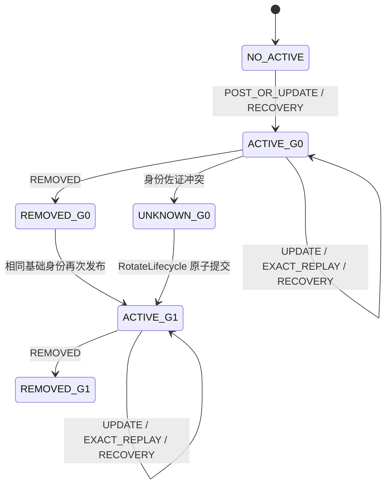
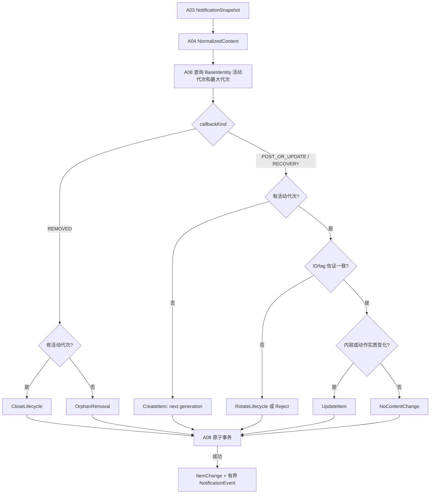

# A05 更新合并与去重规格说明

- **主交付版本**：`v0.2`
- **优先级**：`[A]`
- **规格状态**：`[候选] plan-v1.0`
- **Phase 0 依赖**：`SP-01 真实通知字段与生命周期`、`SP-04 摄取队列、事务与归并`
- **直接依赖**：`A03 通知事件采集`、`A04 条目归一化`、`A08 本地持久化` 的活动代次查询与原子提交端口
- **被依赖**：`A06 稳定排序`、`A07 时间窗应用抽屉`、`A09 原内容跳转`、`A10 常驻状态通知`、`A12 多应用查看筛选`、`A13 B 站端到端真机验收`、`A14 性能基线与回归门槛`

## 1. 目标与范围

`[已确认]` 本功能把同一系统通知活动生命周期内的发布、更新、移除和补扫观察归并到一个 `NotificationItem`，同时保证不同通知不会因为标题或正文相同而误合并。

`[已确认]` 本功能的第一原则是身份优先：内容指纹只判断已确认同一生命周期中的内容变化，绝不作为跨身份去重键。

### 1.1 本功能包含

- `[候选]` 以 `sourceUser + sourcePackage + systemKey` 作为活动通知的基础身份，并用 `lifecycleGeneration` 区分系统 key 关闭后的再次出现。
- `[候选]` 把 `POST_OR_UPDATE` 归类为 `POSTED` 或 `UPDATED`，把移除归类为 `REMOVED`，把重连补扫保留为 `RECOVERY_SNAPSHOT`。
- `[候选]` 对同一活动代次比较规范标题、正文、内容指纹、动作能力和结构化持久目标，输出新建、更新、关闭或无条目变化命令。
- `[已确认]` 保持 `firstReceivedAt`、创建时排序序列和 `itemId` 不变；更新不得把旧条目顶到列表顶部。
- `[候选]` 为每次可识别观察产生最小 `NotificationEventDraft`，即使条目没有变化也保留可对账事实；诊断事件长期有界。
- `[候选]` 对密集更新允许 A08 在不丢事件事实、最终状态和崩溃一致性的前提下合并事务。

### 1.2 本功能不包含

- `[排除]` 不使用标题、正文、来源标签、`postTime`、通知类别或 `contentFingerprint` 单独识别“同一通知”。
- `[排除]` 不模糊匹配近似文本，不使用机器学习或 B 站搜索结果去重。
- `[排除]` 不自动删除重复历史条目；本规则只决定新观察如何映射到逻辑条目。
- `[排除]` 不持久化或比较 `PendingIntent` 对象；只比较 `ActionCapabilitySet` 和结构化 `ActionTargetCandidate`。
- `[排除]` 不决定列表查询顺序和抽屉成员；A06/A07 消费本功能保持不变的时间与键。
- `[排除]` 不锁定 Room 表、索引、唯一约束或迁移方案。

## 2. 术语

| 术语 | 精确定义 |
|---|---|
| 基础身份 `BaseIdentity` | `sourceUser + sourcePackage + systemKey`；只定位当前活动通知候选，不承诺跨重启永久唯一 |
| 身份佐证 | `notificationId` 与 `tag`；用于发现 key 复用或异常，不在没有 `systemKey` 相等时主动合并 |
| 活动代次 | 同一基础身份从首次观察到明确移除/替换之间的生命周期，编号为 `lifecycleGeneration` |
| 新生命周期 | 没有活动代次的 `POST_OR_UPDATE`/补扫，或身份佐证与活动代次冲突时创建的新代次 |
| 条目更新 | 已确认同一活动代次中，规范内容、动作能力、持久目标或生命周期事实发生变化 |
| 精确重放 | 同一活动代次、规范内容、动作能力和持久目标均相同的再次观察；记录事件但不改条目 |
| 误合并 | 两个应独立存在的通知被写成同一个 `NotificationItem`；属于阻断性数据错误 |
| 重复条目 | 同一活动生命周期的重复回调创建多个 `NotificationItem`；属于阻断性数据错误 |

## 3. 用户故事

> 作为用户，我希望 B 站对同一推送的系统更新只更新原条目，而不是刷出很多重复记录。

> 作为用户，我希望两个标题相同但属于不同 UP 主、视频、动态或直播间的通知仍保持为两条，以免去重把真正内容吃掉。

> 作为用户，我希望旧通知被更新时仍留在第一次收到的位置，以便收件箱顺序稳定、可解释。

## 4. 输入契约

### 4.1 `MergeInput`

| 字段 | 逻辑类型 | 必填 | 约束 |
|---|---|---:|---|
| `observation` | `NotificationObservation` | 是 | 来自 A03 的纯数据投影；`identity.lifecycleGeneration` 为空，不含 `runtimeAction` 或 framework 类型 |
| `normalizedContent` | `NormalizedContent?` | 条件 | `POST_OR_UPDATE`/`RECOVERY_SNAPSHOT` 必填；`REMOVED` 必须为空 |
| `persistentTargetCandidates` | `List<ActionTargetCandidate>` | 是 | 可为空；只含结构化目标，不含 `PendingIntent`、`Intent` 或 `Parcel` |
| `activeLifecycle` | `ActiveLifecycleSnapshot?` | 否 | A08 按 `BaseIdentity` 查询的当前活动代次；不存在时为空 |
| `latestGeneration` | `NonNegativeInt?` | 否 | 该基础身份历史最大代次；无历史为空 |
| `mergePolicyVersion` | `MergePolicyVersion` | 是 | Phase 0 锁定的身份与变化规则版本 |

### 4.2 本功能使用的 `NotificationObservation`

| 字段 | 逻辑类型 | 必填 | 用途 |
|---|---|---:|---|
| `runtimeSessionId` | `RuntimeSessionId` | 是 | 生成事件关联 |
| `listenerConnectionId` | `ConnectionId` | 是 | 生成事件关联 |
| `callbackKind` | `ObservedCallbackKind` | 是 | 选择发布/更新、移除或补扫规则 |
| `identity` | `NotificationIdentity` | 是 | 输入代次为空；基础身份与佐证来源 |
| `postTime` | `InstantUtc` | 是 | 生成可空事件来源时间；不作身份或首次排序 |
| `observedAt` | `InstantUtc` | 是 | 首次时间、更新时间和事件观察时间 |
| `observedElapsed` | `MonotonicTime` | 是 | 同运行会话的顺序校验；不跨会话比较 |
| `actionCapabilities` | `ActionCapabilitySet` | 是 | 比较动作能力并生成事件摘要 |
| `policyRevision` | `StableSequence` | 是 | 保存采集并发边界 |
| `removalReason` | `RemovalReason?` | 否 | 仅移除观察可有值 |

`[排除]` A05 不接收 `NotificationObservation.content`、`runtimeAction` 或完整 `NotificationSnapshot`；规范内容只来自 A04，运行时动作只由摄取协调器在提交后处理。

### 4.3 `BaseIdentity`

| 字段 | 逻辑类型 | 必填 | 约束 |
|---|---|---:|---|
| `sourceUser` | `AndroidUserRef` | 是 | 不同 Android 用户或工作资料不混合 |
| `sourcePackage` | `PackageName` | 是 | 来源包名；非空 |
| `systemKey` | `String` | 是 | 当前系统活动通知 key；不承诺跨重启永久唯一 |

### 4.4 本功能使用的 `NormalizedContent`

| 字段 | 逻辑类型 | 必填 | 用途 |
|---|---|---:|---|
| `title` | `String?` | 否 | 当前规范标题 |
| `body` | `String?` | 否 | 当前规范正文 |
| `sourceLabelSnapshot` | `String?` | 否 | 展示来源快照；不是身份键 |
| `originalPostTime` | `InstantUtc?` | 否 | 展示/诊断，不参与身份和首次排序 |
| `contentFingerprint` | `OpaqueFingerprint?` | 否 | 同代次内容变化快速路径 |
| `actionCapabilities` | `ActionCapabilitySet` | 是 | 不含动作令牌 |
| `normalizationWarnings` | `Set<NormalizationWarning>` | 是 | 截断、缺字段等事实 |
| `normalizationStrategyVersion` | `NormalizationStrategyVersion` | 是 | 解释内容规则 |
| `titleOriginalCodePoints` | `NonNegativeInt` | 是 | 截断前标题长度 |
| `bodyOriginalCodePoints` | `NonNegativeInt` | 是 | 截断前正文长度 |

### 4.5 `ActiveLifecycleSnapshot`

| 字段 | 逻辑类型 | 必填 | 约束 |
|---|---|---:|---|
| `itemId` | `ItemId` | 是 | 不变逻辑条目 ID |
| `identity` | `NotificationIdentity` | 是 | `lifecycleGeneration` 非空，且 `lifecycleState=ACTIVE` |
| `firstReceivedAt` | `InstantUtc` | 是 | 创建后不可变 |
| `lastUpdatedAt` | `InstantUtc` | 是 | 最近一次实质变化时间 |
| `ingestSequence` | `StableSequence` | 是 | 创建时分配；不可变 |
| `title` | `String?` | 否 | 当前规范标题 |
| `body` | `String?` | 否 | 当前规范正文 |
| `sourceLabelSnapshot` | `String?` | 否 | 当前来源标签快照；不是身份键 |
| `originalPostTime` | `InstantUtc?` | 否 | A04 校验后的来源时间；不参与身份和首次排序 |
| `contentFingerprint` | `OpaqueFingerprint?` | 否 | 只作同代次快速变化判断 |
| `normalizationWarnings` | `Set<NormalizationWarning>` | 是 | 当前归一化警告集合 |
| `normalizationStrategyVersion` | `NormalizationStrategyVersion` | 是 | 解释当前规范内容的规则版本 |
| `titleOriginalCodePoints` | `NonNegativeInt` | 是 | A04 截断前标题长度 |
| `bodyOriginalCodePoints` | `NonNegativeInt` | 是 | A04 截断前正文长度 |
| `contentRevision` | `NonNegativeInt` | 是 | 创建为 0；内容实质变化时加 1 |
| `actionCapabilities` | `ActionCapabilitySet` | 是 | 当前动作能力摘要 |
| `persistentTargets` | `List<ActionTargetSnapshot>` | 是 | 规范排序后的结构化目标；不含运行时动作 |
| `lifecycleState` | `NotificationLifecycleState` | 是 | 本输入只能为 `ACTIVE` |

### 4.6 `ActionTargetCandidate`

| 字段 | 逻辑类型 | 必填 | 约束 |
|---|---|---:|---|
| `kind` | `PersistentTargetKind` | 是 | `EXACT_URI`、`SOURCE_CONTENT_ID` 或 `APP_LAUNCH` |
| `provider` | `String?` | 否 | 来源专用目标如 `bilibili`；通用目标可空 |
| `payload` | `ValidatedTargetPayload` | 是 | 已通过来源提取器结构校验；不得为序列化 Intent |
| `priority` | `Int` | 是 | 同一条目内确定排序；数值规则由动作规格统一 |
| `validationState` | `TargetValidationState` | 是 | 初次通常为 `UNTESTED`；不得因年龄自动失败 |

`[候选]` 目标集合比较使用 `kind + provider + 规范 payload + priority` 的结构相等，不把 `lastAttemptAt` 或失败重试时间当作通知内容变化。

## 5. 输出契约

### 5.1 `IngestionDecision`

| 变体 | 必填字段 | 含义 |
|---|---|---|
| `CreateItem` | `newIdentity: NotificationIdentity`、`firstReceivedAt: InstantUtc`、`content: NormalizedContent`、`targets: List<ActionTargetCandidate>`、`eventDraft: NotificationEventDraft` | 没有活动代次，创建一个新逻辑条目 |
| `UpdateItem` | `itemId: ItemId`、`normalizedContentChange: NormalizedContent?`、`contentChanged: Boolean`、`metadataChanged: Boolean`、`actionChange: List<ActionTargetCandidate>?`、`lastUpdatedAt: InstantUtc`、`eventDraft: NotificationEventDraft` | 同一活动代次存在实质变化；三个变化维度至少一个为真或非空 |
| `CloseLifecycle` | `itemId: ItemId`、`newState: NotificationLifecycleState`、`removedAt: InstantUtc`、`removalReason: RemovalReason?`、`eventDraft: NotificationEventDraft` | `newState` 必须为 `REMOVED`；关闭但不删除条目 |
| `RotateLifecycle` | `oldItemId: ItemId`、`oldState: NotificationLifecycleState`、`newIdentity: NotificationIdentity`、`content: NormalizedContent`、`targets: List<ActionTargetCandidate>`、`eventDraft: NotificationEventDraft` | `oldState` 必须为 `UNKNOWN`；原代次关闭并新建，须由 Phase 0 允许 |
| `NoContentChange` | `itemId: ItemId`、`eventDraft: NotificationEventDraft`、`reason: NoContentChangeReason` | 精确重放或补扫已存在活动代次；条目不写新内容 |
| `OrphanRemoval` | `failureDraft: PersistenceFailureDraft` | 移除观察没有可匹配活动代次；不创建空通知条目 |
| `Reject` | `errorCode: MergeErrorCode`、`failureDraft: PersistenceFailureDraft` | 输入或归一化结果不满足安全规则 |

`NoContentChangeReason` 是闭合枚举：`EXACT_REPLAY` 表示发布/更新回调与当前条目完全相同，`RECOVERY_MATCH` 表示补扫与当前条目完全相同，`RUNTIME_HANDLE_ONLY` 表示只有不可持久化的运行时动作句柄被刷新。三者都允许写最小事件，但不得修改长期条目内容、排序键或 `contentRevision`。

`UpdateItem` 的字段关系固定如下：`contentChanged=true` 或 `metadataChanged=true` 时 `normalizedContentChange` 必填；二者都为 `false` 时该字段必须为空。动作目标集合变化时 `actionChange` 必须是变化后的完整规范集合，清空全部目标用非空的空列表表示；动作目标不变时 `actionChange=null`。只有这三个变化维度全部无变化时才允许输出 `NoContentChange`。

### 5.1.1 `PersistenceFailureDraft`

| 字段 | 逻辑类型 | 必填 | 约束 |
|---|---|---:|---|
| `failureId` | `FailureId` | 是 | 随机关联 ID，不是通知身份 |
| `errorCode` | `MergeErrorCode` | 是 | 分类枚举 |
| `observedAt` | `InstantUtc` | 是 | 来自 A03 |
| `runtimeSessionId` | `RuntimeSessionId` | 是 | 用于本地诊断关联 |
| `listenerConnectionId` | `ConnectionId?` | 否 | 可安全取得时保存 |
| `hasSafeIdentity` | `Boolean` | 是 | 只说明身份是否可用，不含正文或动作 |

### 5.2 `NotificationEventDraft`

| 字段 | 逻辑类型 | 必填 | 生成规则 |
|---|---|---:|---|
| `itemId` | `ItemId?` | 条件 | 既有条目直接关联；新建草稿为空，由 A08 在事务内分配后关联，调用方只能在提交成功后观察；`OrphanRemoval` 不产生本草稿，只产生失败事实 |
| `identity` | `NotificationIdentity` | 是 | 正常事件的 `lifecycleGeneration` 非空 |
| `eventKind` | `NotificationEventKind` | 是 | `POSTED`、`UPDATED`、`REMOVED` 或 `RECOVERY_SNAPSHOT` |
| `postTime` | `InstantUtc?` | 否 | 来源时间；移除可沿用输入或为空 |
| `observedAt` | `InstantUtc` | 是 | A03 的本机观察时间 |
| `contentFingerprint` | `OpaqueFingerprint?` | 否 | 只存摘要，不保存第二份正文 |
| `actionSummary` | `ActionCapabilitySet` | 是 | 能力位，不含动作令牌和完整目标 |
| `removalReason` | `RemovalReason?` | 否 | 仅移除事件可有值 |
| `runtimeSessionId` | `RuntimeSessionId` | 是 | 原样关联 A03 会话 |
| `listenerConnectionId` | `ConnectionId` | 是 | 原样关联 A03 连接 |
| `policyRevision` | `StableSequence` | 是 | 回调采集时使用的策略修订 |
| `mergePolicyVersion` | `MergePolicyVersion` | 是 | 产生本决策的规则版本 |

`[候选]` A08 为事件分配 `eventId`、`ingestSequence` 和 `retentionOrder`；本功能不锁定其物理类型。

### 5.3 `ItemChange`（事务提交后）

| 变体 | 字段 | 消费方 |
|---|---|---|
| `ITEM_CREATED` | `itemId: ItemId`、`sourcePackage: PackageName`、`firstReceivedAt: InstantUtc` | A06、A10、UI |
| `ITEM_UPDATED` | `itemId: ItemId`、`contentChanged: Boolean`、`metadataChanged: Boolean`、`actionChanged: Boolean`、`lastUpdatedAt: InstantUtc` | 详情、A10；不得改变主排序 |
| `ITEM_REMOVED_FROM_SYSTEM` | `itemId: ItemId`、`removedAt: InstantUtc` | 详情和诊断；条目仍在收件箱 |
| `NO_ITEM_CHANGE` | `itemId: ItemId`、`eventKind: NotificationEventKind` | 诊断；不得刷新整表或成功计数 |

`[已确认]` `ItemChange` 只有 A08 事务提交成功后产生。纯 `IngestionDecision` 不构成已记录事实。

## 6. 生命周期状态机

- `[候选]` 首次代次为 0；后续代次为该基础身份历史最大值加 1。A08 必须在同一串行事务边界查询/分配，避免并发得到相同代次。
- `[候选]` `REMOVED` 和 `UNKNOWN` 都关闭活动代次，但不删除长期条目和动作目标。
- `[待验证]` `RotateLifecycle` 只有 `SP-01/SP-04` 证明同一 `systemKey` 可能出现身份佐证冲突时启用；否则冲突作为失败隔离，不擅自覆盖旧条目。

## 7. 判定规则顺序

### 7.1 通用前置检查

1. `[候选]` 验证 `snapshot.identity.lifecycleGeneration=null`，且 `sourcePackage`、`sourceUser`、`systemKey` 与查询使用的 `BaseIdentity` 完全一致。
2. `[候选]` 对 `POST_OR_UPDATE`/`RECOVERY_SNAPSHOT` 要求 `normalizedContent` 非空；对 `REMOVED` 要求其为空。
3. `[候选]` 把 `persistentTargetCandidates` 规范排序并去除结构完全相同的重复候选；该步骤不使用标题或正文。
4. `[候选]` 若 `activeLifecycle` 存在，验证其状态为 `ACTIVE` 且基础身份与输入完全一致；不一致则 `Reject(ACTIVE_LOOKUP_MISMATCH)`。

### 7.2 `REMOVED`

1. `[候选]` 有匹配活动代次时输出 `CloseLifecycle`，事件类型为 `REMOVED`。
2. `[候选]` 没有匹配活动代次时输出 `OrphanRemoval`，保存不含正文的失败事实；不创建空 `NotificationItem`。
3. `[已确认]` 关闭代次不修改 `firstReceivedAt`、创建 `ingestSequence`、标题、正文或既有持久目标。

### 7.3 `POST_OR_UPDATE` 与 `RECOVERY_SNAPSHOT`

1. `[候选]` 没有活动代次时，新代次为 `latestGeneration + 1`，无历史时为 0，输出 `CreateItem`。`firstReceivedAt=snapshot.observedAt`，不使用 `postTime`。
2. `[候选]` 存在活动代次且 `notificationId`、`tag` 与活动身份一致时，确认属于同一生命周期，再比较内容和动作。
3. `[候选]` `contentChanged` 比较 `title` 和 `body` 的规范值；`contentFingerprint` 只作快速路径。即使指纹相同但规范文本不同，也必须视为变化，防止摘要碰撞吞掉更新。
4. `[候选]` `metadataChanged` 比较 `sourceLabelSnapshot`、`originalPostTime`、`normalizationWarnings`、原始代码点数和 `normalizationStrategyVersion`；这些变化更新条目但不增加 `contentRevision`。
5. `[候选]` 动作变化比较 `ActionCapabilitySet` 和结构化目标集合；`PendingIntent` 引用变化不进入持久比较，只更新进程内 `RuntimeActionRegistry`。
6. `[候选]` 内容变化时输出 `UpdateItem` 且 `contentRevision + 1`；只有元数据或动作变化时 `contentRevision` 不变。
7. `[候选]` 任一实质变化使 `lastUpdatedAt=snapshot.observedAt`；无变化时保持原值。
8. `[候选]` 内容、元数据和动作都不变时输出 `NoContentChange`。普通回调的事件类型为 `UPDATED`，补扫保持 `RECOVERY_SNAPSHOT`。
9. `[候选]` 身份佐证冲突时不得覆盖活动条目；根据 Phase 0 锁定规则输出 `RotateLifecycle` 或 `Reject(IDENTITY_CONFLICT)`。

### 7.4 明确禁止的去重规则

- `[排除]` 不因标题相同、正文相同、来源标签相同、`postTime` 相同或内容指纹相同合并不同基础身份。
- `[排除]` 不因 `notificationId + tag` 相同而跨不同 `systemKey` 主动合并。
- `[排除]` 不因持久 URI 或内容 ID 相同而合并两个系统通知；同一内容的两次独立推送仍可形成两条记录。
- `[排除]` 不把补扫视为天然新通知，也不把移除后重发覆盖到旧条目。

## 8. Given / When / Then 验收条件

1. **首次发布创建条目**：
   Given 基础身份没有活动或历史代次，When 收到 `POST_OR_UPDATE`，Then 输出 `CreateItem`，代次为 0，`firstReceivedAt=observedAt`。

2. **同一通知更新**：
   Given 活动代次身份一致且正文变化，When 收到下一次 `POST_OR_UPDATE`，Then 输出 `UpdateItem`，`contentRevision` 加 1，`firstReceivedAt` 与创建序列保持不变。

3. **更新不顶置**：
   Given条目首次收到时间为 T1，When 在 T2 更新，Then `lastUpdatedAt=T2`，默认排序仍使用 T1。

4. **精确重放**：
   Given身份、规范文本、动作能力和持久目标完全相同，When 同一回调被重放，Then输出 `NoContentChange` 和最小事件草稿，不新增条目、不增加内容修订。

5. **相同文本不同身份**：
   Given 两条通知标题和正文相同但 `systemKey` 不同，When 依次处理，Then形成两个独立 `NotificationItem`，即使指纹相同。

6. **相同系统 ID 不同用户**：
   Given 包名、ID、tag 和文本相同但 `sourceUser` 不同，When处理，Then形成两个独立基础身份。

7. **移除关闭代次**：
   Given 存在活动代次 G0，When 收到匹配 `REMOVED`，Then输出 `CloseLifecycle(G0)`，条目保留且状态为 `REMOVED`。

8. **移除后重发**：
   Given G0 已关闭，When 相同基础身份再次发布，Then创建 G1，不覆盖 G0，G1 的首次时间为新观察时间。

9. **孤立移除**：
   Given 没有匹配活动代次，When 收到 `REMOVED`，Then输出 `OrphanRemoval`，不创建空条目，不崩溃。

10. **补扫已有活动通知**：
    Given G0 已活动且内容未变，When 重连补扫同一通知，Then输出 `NoContentChange(eventKind=RECOVERY_SNAPSHOT)`，不创建重复条目。

11. **补扫发现仍活动但本地无条目**：
    Given 本地没有活动代次，When 补扫观察到一条系统活动通知，Then创建新条目并把事件标为 `RECOVERY_SNAPSHOT`；不声称知道断连期间的首次发布时间。

12. **指纹碰撞防护**：
    Given同一活动代次的两个规范文本不同但测试指纹被故意设为相同，When更新，Then仍按文本直接比较识别为内容变化。

13. **动作单独变化**：
    Given标题正文不变但结构化持久目标发生变化，When更新，Then输出 `UpdateItem(actionChanged=true, contentChanged=false, metadataChanged=false)`，内容修订不增加。

14. **运行时句柄变化**：
    Given只有 `PendingIntent` 对象引用变化而能力摘要和持久目标相同，When处理，Then持久条目为 `NoContentChange`，运行时注册表可替换句柄。

15. **并发同身份更新**：
    Given两个同身份更新几乎同时到达，When经单消费者按观察顺序处理，Then最终内容等于后一个观察，每个事件可对账，代次和首次时间不竞争。

16. **事务中断**：
    Given `RotateLifecycle` 或 `UpdateItem` 正在提交，When进程在事务中终止，Then重启后只能看到完整旧状态或完整新状态，不出现旧代次关闭而新代次缺失的半状态。

17. **100 条突发**：
    Given数据集包含重复回调、密集更新、同文不同身份和移除重发，When全部处理，Then预期逻辑条目数、修订数、事件数和最终内容完全一致，无误合并和重复条目。

## 9. 边界条件

| 边界 | 必须行为 |
|---|---|
| 标题或正文为空 | 身份规则不变；空值不是去重键 |
| 内容指纹为空 | 直接比较规范标题/正文；不得退化为按包名合并 |
| 指纹碰撞 | 规范文本不同即视为内容变化 |
| `tag=null` | 空值合法；与活动代次的空值进行结构相等比较 |
| 同一时间戳 | 不影响身份；A08/A06 使用持久稳定序列形成全序 |
| 多线程回调 | A03 可并发形成快照，A05 必须在单消费者和串行活动代次读写边界执行 |
| 密集更新 | 保留每次最小事件事实；允许事务批处理，但最终条目、事件顺序和崩溃一致性不得丢失 |
| 回调重放 | 同一活动代次不新增条目；事件可记录再次观察 |
| 补扫重放 | 不新增已存在活动条目；仍标明补扫来源 |
| 进程终止 | 只承认 A08 已提交决策；未提交内存状态不构成事实 |
| 来源应用更新/强停 | 不凭应用进程状态改写条目身份；后续新系统观察按代次规则处理 |
| 网络断开 | 无影响；本功能不联网 |
| `PendingIntent` 失效 | 不删除或合并条目；动作结果由 A09 单独记录 |

## 10. 错误状态

| 错误码 | 触发条件 | 用户可见结果 | 系统行为 |
|---|---|---|---|
| `NORMALIZATION_REQUIRED` | 发布/更新/补扫缺少 `NormalizedContent` | “一条通知内容解析失败，未保存” | 不创建/覆盖条目；保存去内容失败事实 |
| `ACTIVE_LOOKUP_MISMATCH` | 仓储返回的活动条目与查询基础身份不同 | 健康页显示数据一致性异常 | 停止该条提交，保留旧数据，禁止猜测合并 |
| `IDENTITY_CONFLICT` | 同一基础 key 的 ID/tag 与活动代次冲突且 Phase 0 未授权旋转规则 | “一条通知身份冲突，未合并” | 不覆盖旧条目；记录脱敏冲突枚举 |
| `GENERATION_ALLOCATION_FAILED` | 无法原子读取/分配下一代次 | “该条可能未保存” | 事务失败，不使用进程内计数替代 |
| `TARGET_NORMALIZATION_FAILED` | 某结构化目标不合法 | 条目仍可保存，跳转能力显示降级 | 丢弃该目标候选并记录枚举；不影响正文归并 |
| `PERSISTENCE_CONFLICT` | 提交时活动代次已被另一决策改变 | “记录发生并发冲突” | 在串行边界重新读取一次；仍冲突则明确失败，不无限重试 |
| `PERSISTENCE_FAILED` | A08 事务失败或存储不足 | “该条可能未保存” | 不发 `ItemChange`，不增加成功计数 |
| `UNKNOWN_MERGE_FAILURE` | 未分类规则异常 | “一条通知处理失败” | 隔离该条，不修改旧数据，继续后续通知 |

## 11. 数据流

### 11.1 交互边界

- `[已确认]` A05 不直接刷新列表、常驻通知或成功计数；这些消费方只能接收 A08 提交后的 `ItemChange`。
- `[已确认]` 更新既有条目不得把条目顶到列表顶部；详情可显示 `lastUpdatedAt` 和生命周期状态，但默认位置由不变的首次时间与创建序列决定。
- `[候选]` 身份冲突、孤立移除和归并失败映射为去内容诊断状态，不向用户展示系统 key、正文、目标载荷或内部异常。

## 12. 隐私与性能约束

### 12.1 隐私

- `[已确认]` `NotificationEventDraft` 不保存第二份标题、正文、完整 URI、内容 ID、`PendingIntent` 或 `Intent`。
- `[候选]` 冲突和失败日志只含枚举、匿名内部 ID、时间和必要身份类别；是否保留包名由 Phase 0 诊断隐私规则锁定。
- `[已确认]` 内容指纹不输出到公开日志或诊断导出，不跨设备使用。
- `[已确认]` 本功能无网络、无遥测，不调用来源应用 API。

### 12.2 性能

- `[候选]` 活动代次查找和最大代次分配是按基础身份的局部操作；不得扫描全部历史。
- `[候选]` 比较只涉及当前活动条目的紧凑快照和当前目标集合；不加载历史事件正文或其他应用条目。
- `[待验证]` 100 条突发的最大处理耗时、事务数、事件批量上限和峰值 PSS由 Phase 0 锁定。
- `[已确认]` 无通知时不运行去重扫描、定期压缩或全库修复。
- `[已确认]` 性能优化不得通过只保留最后回调、丢弃事件事实或放松误合并断言实现。

## 13. 测试要求

### 13.1 自动化测试

- 状态机表驱动：首次发布、更新、精确重放、移除、移除后重发、补扫、孤立移除和身份冲突。
- 去重反例：同标题不同 key、同正文不同目标、同 ID/tag 不同 key、同 key 不同 Android 用户、同持久目标两次独立推送。
- 指纹反例：空指纹、相同指纹不同文本、不同指纹相同文本和策略版本变化。
- 不变量性质测试：`firstReceivedAt`、创建 `ingestSequence`、`itemId` 不随任意更新序列改变；每个活动基础身份最多一个活动代次。
- 随机事件序列性质测试：生成发布/更新/移除/补扫序列，重放后最终条目集合符合参考状态机。
- 并发测试：多来源和同来源交错输入经单消费者后顺序确定，不出现代次竞争。
- 失败隔离：归一化缺失、仓储错配、代次分配失败和事务冲突不覆盖旧数据。

### 13.2 集成测试

- A03→A04→A05→A08 完整链路逐事件对账，核对事件、条目、动作目标和健康事实原子结果。
- 事务中途强制终止：`CreateItem`、`UpdateItem`、`CloseLifecycle`、`RotateLifecycle` 分别只允许完整旧/新状态。
- 分页回归：更新后 A06 查询位置不改变；移除状态变化不删除条目。
- 100 条版本化数据集：输入数、事件数、条目数、更新数、无变化数、孤立失败数可核对。

### 13.3 红魔 11 Pro+ 真机测试

- 对 B 站投稿、动态和开播分别采集实际发布—更新—移除序列，确认同一推送不重复刷屏。
- 构造至少两个相同标题/正文但目标不同的真实或可控通知，确认不误合并。
- 覆盖监听断连重连和活动通知补扫；重启 OMN 后条目数和活动状态可解释。
- 100 条突发记录误合并、重复条目、最终内容、事务数、CPU、PSS、写盘增长和处理时间。

## 14. Phase 0 未决项与决策门

| 未决项 | 必须证据 | `GO` 条件 | 未通过处理 |
|---|---|---|---|
| 基础身份与 ID/tag 佐证 | B 站三类和可控 key 复用序列 | 不靠正文即可区分更新、新生命周期和不同用户 | 更新身份模型并同步 A03/A08，不建正式 schema |
| `lifecycleGeneration` 分配 | 移除重发、补扫和进程终止测试 | 原子、确定、无并发重复代次 | 调整串行事务边界；不进入 v0.2 |
| `RotateLifecycle` 是否启用 | 真实身份冲突反例 | 有唯一可解释的关闭/新建规则，旧数据不被覆盖 | 冲突保持显式失败，不猜测旋转 |
| 诊断事件逐条或安全批量 | 100 条突发、崩溃一致性和漏记诊断 | 每次观察可对账，事务数与写盘满足预算 | 保留逐条事务正确性，继续性能设计 |
| 内容指纹比较策略 | 碰撞、空内容和策略升级测试 | 指纹只作快速路径，直接文本比较阻止误判 | 禁用指纹优化，不改变身份规则 |
| 绝对性能预算 | release 真机 100 条与 10,000 条历史 | 误合并/重复为零，CPU/PSS/写盘满足锁定预算 | 优化局部查询和批量边界，不放宽正确性 |

`[已确认]` `SP-01` 和 `SP-04` 未给出可复现身份正反例前，不得把 A05 的候选身份规则固化为 Room 唯一约束或迁移承诺。
