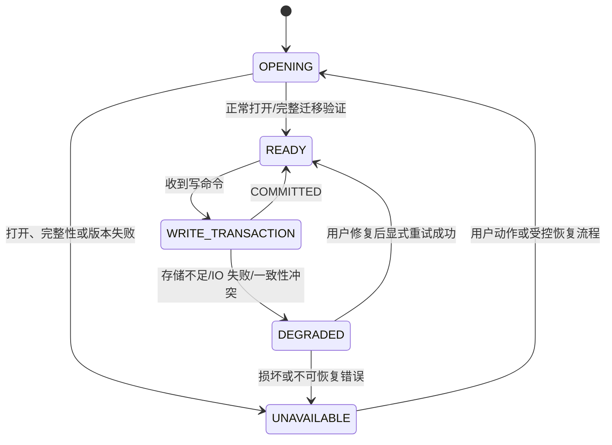
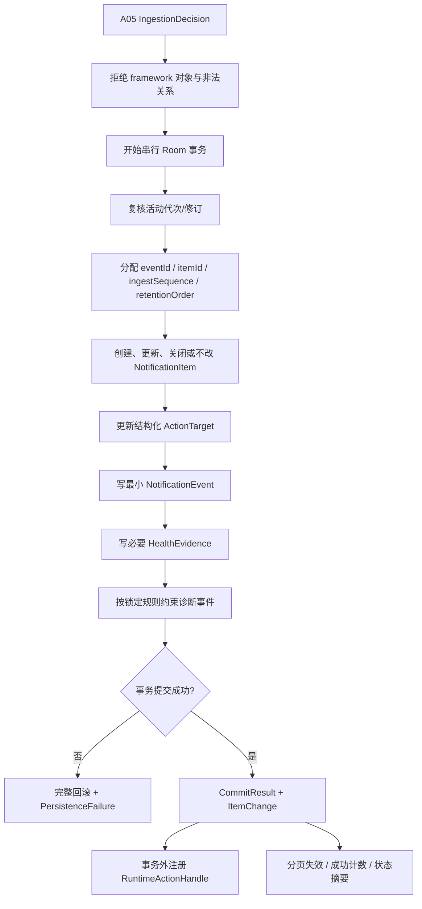

# A08 本地持久化规格说明

- **主交付版本**：`v0.1`
- **优先级**：`[A]`
- **规格状态**：`[候选] plan-v1.0`
- **Phase 0 依赖**：`SP-04 摄取队列、事务与归并`、`SP-09 持久化、隐私与性能基线`
- **直接依赖**：`A03 通知事件采集`、`A04 条目归一化`；`v0.2` 接入 `A05 更新合并与去重` 的完整决策
- **被依赖**：`A02 应用排除列表`、`A05 更新合并与去重`、`A06 稳定排序`、`A07 时间窗应用抽屉`、`A09 原内容跳转`、`A10 常驻状态通知`、`A11 健康状态时间轴`、`A12 多应用查看筛选`、`A13 B 站端到端真机验收`、`B01/B02/B03`

## 1. 目标与范围

`[已确认]` 本功能使用 Room 把长期 `NotificationItem`、有界 `NotificationEvent`、结构化 `ActionTarget`、`MonitoringPolicy` 和 `HealthEvidence` 保存在 Android 应用私有空间，并为写入链路提供崩溃原子性和稳定分页读取。

`[已确认]` 本规格只定义逻辑数据、事务、不变量和查询契约，不锁定 Room entity、表名、列名、主键物理类型、索引、外键、TypeConverter、数据库文件名、schema 版本或迁移实现。

### 1.1 本功能包含

- `[候选]` 为一次摄取决策原子写入最小事件、条目变化、结构化持久目标和必要健康证据。
- `[候选]` 在事务内分配稳定 `eventId`、`itemId`、`ingestSequence`、`retentionOrder` 和生命周期代次所需序列。
- `[已确认]` 在应用进程重建和手机重启后保留已提交的长期条目、结构化目标、策略和健康事实。
- `[候选]` 提供按基础身份查活动代次、查最大代次、按稳定顺序分页、按条目读取详情/目标和按时间读取健康证据的端口。
- `[已确认]` 长期通知条目默认不自动删除；诊断事件按 Phase 0 锁定的明确条数或时间上限保持有界。
- `[已确认]` 通知数据库、动作目标及含通知信息的设置排除 Android 自动云备份和跨设备自动迁移。

### 1.2 本功能不包含

- `[排除]` 不持久化 `PendingIntent`、`Intent`、`Parcel` 字节、Binder 句柄、`StatusBarNotification`、`Notification`、`Bundle` 或 framework 位图。
- `[排除]` 不把原始诊断事件做成第二份标题和正文。
- `[排除]` v0 不额外加密数据库，不提供应用锁、云同步、服务端备份或自动跨设备恢复。
- `[排除]` 不静默删除长期通知条目，不因磁盘不足淘汰旧条目后伪装新通知已成功保存。
- `[排除]` 不通过删除数据库、破坏性重建或忽略迁移错误恢复损坏。
- `[排除]` 不在本规格中实施任何 schema 变更或迁移；未来每次变更都必须先通过项目红线审批。
- `[排除]` 不为统计、压缩或清理运行周期轮询、唤醒锁、精确闹钟或高频 WorkManager。

## 2. 术语

| 术语 | 精确定义 |
|---|---|
| 逻辑存储 | 按领域职责描述的数据集合；不等同于一张 Room 表 |
| 摄取事务 | 把一个或一批已排序观察对应的事件、条目变化、目标和健康事实原子提交的边界 |
| 完整旧状态/完整新状态 | 进程在事务任一点终止后，重启只能看到事务开始前或全部提交后的不变量状态 |
| 已提交 | Room 事务成功返回；只有该状态允许发布用户可见成功计数或 `ItemChange` |
| 长期条目 | `NotificationItem`；v0 不按年龄或容量自动删除 |
| 诊断事件 | `NotificationEvent` 和最小内部失败事实；用于漏记/归并对账，必须有界 |
| 稳定游标 | 由不可变排序字段构成的分页位置；相同数据重复查询不得漂移 |
| schema | Room 的物理 entity、表、列、索引、约束和版本；本规格不作锁定 |

## 3. 用户故事

> 作为用户，我希望已收到的通知在手动划除、OMN 进程重建和手机重启后仍然存在，以便稍后能找到并尝试回到原内容。

> 作为用户，我希望写盘失败或存储不足时应用明确告诉我哪段时间可能未保存，而不是增加“已救回”计数。

> 作为重视隐私的用户，我希望通知正文和动作目标只留在本机应用私有空间，不被自动云备份、日志或公开仓库带走。

## 4. 逻辑存储契约

### 4.1 `NotificationItemStore`（长期）

| 字段 | 逻辑类型 | 必填 | 不变量 |
|---|---|---:|---|
| `itemId` | `ItemId` | 是 | 创建后不变 |
| `identity` | `NotificationIdentity` | 是 | `lifecycleGeneration` 非空；同一活动基础身份最多一个活动代次 |
| `sourcePackage` | `PackageName` | 是 | 不存逐条图标位图 |
| `sourceUser` | `AndroidUserRef` | 是 | 不同 Android 用户不混合 |
| `sourceLabelSnapshot` | `String?` | 否 | 候选逻辑契约要求非空值原样保存；若 Phase 0 否决该字段，必须先同步修订 A04/A05/A08，不能由实现单独丢弃 |
| `title` | `String?` | 否 | 规范标题；空值合法 |
| `body` | `String?` | 否 | 规范正文；空值合法 |
| `contentFingerprint` | `OpaqueFingerprint?` | 否 | 只用于同代次变化判断，不是跨条目唯一键 |
| `normalizationWarnings` | `Set<NormalizationWarning>` | 是 | 缺字段、截断和字符处理事实；不得含原始文本 |
| `titleOriginalCodePoints` | `NonNegativeInt` | 是 | A04 截断前标题长度 |
| `bodyOriginalCodePoints` | `NonNegativeInt` | 是 | A04 截断前正文长度 |
| `firstReceivedAt` | `InstantUtc` | 是 | 创建时取 A03 `observedAt`；后续不可变 |
| `lastUpdatedAt` | `InstantUtc` | 是 | 创建时等于首次时间；A05 判定内容、归一化元数据或动作实质变化时更新 |
| `originalPostTime` | `InstantUtc?` | 否 | A04 校验后的来源时间；不替代首次时间 |
| `ingestSequence` | `StableSequence` | 是 | 创建事务分配；不可变，作为稳定次级排序键 |
| `contentRevision` | `NonNegativeInt` | 是 | 创建为 0；内容实质变化时递增 |
| `lifecycleState` | `NotificationLifecycleState` | 是 | `ACTIVE`、`REMOVED` 或 `UNKNOWN`；移除不删除条目 |
| `actionState` | `ActionStateSummary` | 是 | 能力与最近尝试摘要；不含运行时令牌 |
| `normalizationStrategyVersion` | `NormalizationStrategyVersion` | 是 | 解释长期文本如何形成 |
| `mergePolicyVersion` | `MergePolicyVersion` | 是 | 解释生命周期决策规则 |

`[排除]` `NotificationItemStore` 不含已读、未读、待办、自动归档、大图、媒体、`PendingIntent` 或逐条应用图标。

`ActionStateSummary` 的逻辑字段固定为：`actionCapabilities: ActionCapabilitySet`、`persistentTargetCount: NonNegativeInt`、`lastAttemptAt: InstantUtc?`、`lastAttemptResult: ActionAttemptResult?`。其中 `actionCapabilities` 是最近观察到的能力事实，不等于当前进程仍持有运行时句柄。

`ActionAttemptResult` 是长期可保存的最小结果值：`strategy: ActionExecutionKind`、`succeeded: Boolean`、`failureReason: ActionFailureReason?`。`succeeded=true` 时 `failureReason` 必须为空；`succeeded=false` 时 `failureReason` 必填。它不保存异常原文、完整 URI、内容 ID、Intent 或令牌；`ActionExecutionKind` 的闭合值为 `RUNTIME_EXACT`、`PERSISTENT_EXACT`、`PERSISTENT_SOURCE_ID`、`APP_LAUNCH`。

### 4.2 `NotificationEventStore`（有界诊断）

| 字段 | 逻辑类型 | 必填 | 不变量 |
|---|---|---:|---|
| `eventId` | `EventId` | 是 | 不变内部 ID |
| `itemId` | `ItemId?` | 条件 | 当前 A05 正常事件提交后必填；可空类型保留架构兼容性，但 v0 的 `OrphanRemoval` 写独立失败事实，不写 `itemId=null` 的事件 |
| `identity` | `NotificationIdentity` | 是 | 正常事件代次非空；身份不可安全读取的观察进入独立 `PersistenceFailure`，不伪造事件 |
| `eventKind` | `NotificationEventKind` | 是 | `POSTED`、`UPDATED`、`REMOVED` 或 `RECOVERY_SNAPSHOT`；失败事实使用独立错误枚举 |
| `postTime` | `InstantUtc?` | 否 | 来源时间，不保证存在 |
| `observedAt` | `InstantUtc` | 是 | OMN 实际观察时间 |
| `ingestSequence` | `StableSequence` | 是 | 事务提交顺序；同一安装单调递增 |
| `contentFingerprint` | `OpaqueFingerprint?` | 否 | 不保存标题或正文副本 |
| `actionSummary` | `ActionCapabilitySet` | 是 | 能力位，不含令牌和完整目标 |
| `removalReason` | `RemovalReason?` | 否 | 仅移除事件可有值 |
| `runtimeSessionId` | `RuntimeSessionId` | 是 | 关联采集会话 |
| `listenerConnectionId` | `ConnectionId` | 是 | 原样关联 A03 当前监听连接；无合法连接的失败观察进入独立失败事实 |
| `policyRevision` | `StableSequence` | 是 | 采集决策修订 |
| `mergePolicyVersion` | `MergePolicyVersion` | 是 | 解释本事件的生命周期归并规则 |
| `retentionOrder` | `StableSequence` | 是 | 确定性裁剪诊断事件 |

### 4.3 `ActionTargetStore`（长期结构化目标）

| 字段 | 逻辑类型 | 必填 | 不变量 |
|---|---|---:|---|
| `targetId` | `TargetId` | 是 | 不变内部 ID |
| `itemId` | `ItemId` | 是 | 关联长期条目；条目删除前保留受支持目标 |
| `kind` | `PersistentTargetKind` | 是 | `EXACT_URI`、`SOURCE_CONTENT_ID`、`APP_LAUNCH` |
| `provider` | `String?` | 否 | 来源专用目标标识，如 `bilibili` |
| `payload` | `ValidatedTargetPayload` | 是 | 规范 URI 或内容类型 + ID；不得为任意序列化 Intent |
| `priority` | `Int` | 是 | 同一条目的确定执行顺序 |
| `validationState` | `TargetValidationState` | 是 | 不按记录年龄自动失败 |
| `lastAttemptAt` | `InstantUtc?` | 否 | 仅实际点击时更新，不后台探测 |
| `lastFailureReason` | `ActionFailureReason?` | 否 | 只存枚举，不存异常原文或完整 URI |

### 4.4 `MonitoringPolicyStore`

| 字段 | 逻辑类型 | 必填 | 不变量 |
|---|---|---:|---|
| `alwaysExcludedPackages` | `Set<PackageName>` | 是 | 必含 OMN 包名，用户不可取消 |
| `userExcludedSources` | `Set<AppUserKey>` | 是 | 只影响成功修订后的未来采集 |
| `changedAt` | `InstantUtc` | 是 | UTC 时间 |
| `revision` | `StableSequence` | 是 | 每次成功修改递增；与热路径快照一致 |

`[已确认]` `MonitoringPolicyStore` 不保存 `InboxFilter`；采集排除和查看筛选不得复用同一字段或集合。

### 4.5 `HealthEvidenceStore`

| 字段 | 逻辑类型 | 必填 | 不变量 |
|---|---|---:|---|
| `evidenceId` | `EvidenceId` | 是 | 不变内部 ID |
| `runtimeSessionId` | `RuntimeSessionId` | 是 | 每个进程会话唯一 |
| `listenerConnectionId` | `ConnectionId?` | 条件 | 监听事实有值；权限/渠道观察可为空 |
| `kind` | `HealthEvidenceKind` | 是 | 只记录实际观察，不保存推断停机时刻 |
| `occurredAt` | `InstantUtc` | 是 | UTC 时间 |
| `occurredElapsed` | `MonotonicTime?` | 否 | 同进程顺序校验，不跨重启比较 |
| `facet` | `HealthFacet` | 是 | `LISTENER`、`LISTENER_ACCESS`、`STATUS_PERMISSION`、`STATUS_CHANNEL` 或 `PROCESS` |
| `value` | `HealthFactValue` | 是 | 离散事实，不含通知正文 |

## 5. 写入输入契约

### 5.1 `PersistIngestionCommand`

| 字段 | 逻辑类型 | 必填 | 约束 |
|---|---|---:|---|
| `observationId` | `ObservationId` | 是 | A03 为当前摄取流程分配；用于把命令、提交结果或去内容失败对账，不持久化为通知身份 |
| `decision` | `IngestionDecision` | 是 | 来自 A05；`v0.1` 的单条闭环使用相同命令子集 |
| `healthEvidenceCandidates` | `List<HealthEvidenceCandidate>` | 是 | 可为空；通知回调事实应与条目变化同事务 |
| `expectedActiveItemId` | `ItemId?` | 否 | 更新/关闭/旋转时用于检测陈旧决策 |
| `expectedContentRevision` | `NonNegativeInt?` | 否 | 更新时检测并发覆盖；串行路径仍保留不变量检查 |

`decision.eventDraft`、`decision.targets` 或 `decision.actionChange` 是事件和目标的唯一权威输入，命令不得再携带一份可分歧副本。`OrphanRemoval`/`Reject` 的去内容失败来自 `decision.failureDraft`。

`[排除]` `PersistIngestionCommand` 及其 `decision` 不允许包含 `PendingIntent`、`Intent`、`Parcel`、`StatusBarNotification`、`Bundle`、位图或完整 extras。若运行时动作存在，摄取协调器在提交成功后用返回的 `itemId` 单独注册到 `RuntimeActionRegistry`。

### 5.2 `PersistPolicyCommand`

| 字段 | 逻辑类型 | 必填 | 约束 |
|---|---|---:|---|
| `newUserExcludedSources` | `Set<AppUserKey>` | 是 | 完整目标集合，不是增量 UI 状态 |
| `expectedRevision` | `StableSequence` | 是 | 与当前修订不同则返回冲突 |
| `changedAt` | `InstantUtc` | 是 | 用户确认操作的 UTC 时间 |

## 6. 读取输入与输出契约

### 6.1 领域读取端口

| 端口 | 输入 | 输出 | 约束 |
|---|---|---|---|
| `findActiveLifecycle` | `BaseIdentity` | `ActiveLifecycleSnapshot?` | 只返回一个活动代次；多个结果是数据一致性错误 |
| `findLatestGeneration` | `BaseIdentity` | `NonNegativeInt?` | 无历史为空；不得扫描无关来源全文 |
| `loadItem` | `ItemId` | `NotificationItem?` | 不返回 Room entity |
| `loadPersistentTargets` | `ItemId` | `List<ActionTargetSnapshot>` | 按 `priority` 和稳定次级键排序 |
| `pageItems` | `InboxPageRequest` | `InboxPage` | 使用稳定游标，不全表载入 |
| `readHealthEvidence` | `ClosedRange<InstantUtc>`、可选 facet | `List<HealthEvidence>` 或分页结果 | 查询范围有限；具体分页阈值 Phase 0 锁定 |
| `readMonitoringPolicy` | 无 | `MonitoringPolicy` | 持久修订与热路径快照一致 |
| `readStorageSummary` | 用户打开设置页或明确操作 | `StorageSummary` | 不建立周期扫描任务 |

### 6.2 `InboxPageRequest`

| 字段 | 逻辑类型 | 必填 | 约束 |
|---|---|---:|---|
| `includedSources` | `Set<AppUserKey>` | 是 | 空集合表示全部已保存来源；只影响读取 |
| `beforeCursor` | `ItemCursor?` | 否 | 首页面为空；后续页使用上一页最后一项的不可变键 |
| `limit` | `PositiveInt` | 是 | 不超过 Phase 0 锁定最大页大小 |

`ItemCursor` 逻辑字段固定为 `firstReceivedAt + ingestSequence + itemId`。基础顺序固定为三者倒序；物理索引由 Phase 0 查询计划决定，不在本规格锁定。

### 6.3 `CommitResult`

| 字段 | 逻辑类型 | 必填 | 说明 |
|---|---|---:|---|
| `observationId` | `ObservationId` | 是 | 原样返回命令关联 ID；成功和失败均可与 A03 对账 |
| `status` | `CommitStatus` | 是 | `COMMITTED` 或 `FAILED`；没有“可能成功” |
| `itemId` | `ItemId?` | 条件 | 条目新建/更新/关闭/无变化时返回；孤立失败可空 |
| `eventId` | `EventId?` | 条件 | 正常事件提交后返回 |
| `ingestSequence` | `StableSequence?` | 条件 | 正常事件提交后返回 |
| `itemChange` | `ItemChange?` | 否 | 条目实质变化或 `NO_ITEM_CHANGE`；只在提交后产生 |
| `committedAt` | `InstantUtc?` | 条件 | 成功时为提交完成观察时间；不参与条目默认排序 |
| `failure` | `PersistenceFailure?` | 条件 | 失败时必填，不含正文或动作 |

### 6.4 `PersistenceFailure`

| 字段 | 逻辑类型 | 必填 | 约束 |
|---|---|---:|---|
| `failureId` | `FailureId` | 是 | 不含来源内容的随机关联 ID |
| `code` | `PersistenceErrorCode` | 是 | 与第 11 节错误码一一对应 |
| `occurredAt` | `InstantUtc` | 是 | 失败被观察到的 UTC 时间 |
| `affectedObservationIds` | `List<ObservationId>` | 是 | 可为空；不得包含通知正文或系统 key 原文 |
| `retryDisposition` | `RetryDisposition` | 是 | `NO_AUTOMATIC_RETRY`、`USER_ACTION_REQUIRED` 或 Phase 0 锁定的 `BOUNDED_RETRY` |
| `affectedRangeStart` | `InstantUtc?` | 否 | 能确定时供用户说明可能漏记起点 |
| `messageKey` | `StringResourceKey` | 是 | 映射本地化文案，不保存异常原文 |

## 7. 摄取事务规则顺序

对一个 `PersistIngestionCommand` 执行：

1. `[候选]` 在事务外拒绝任何 framework 对象、未规范目标或违反必填关系的命令；返回分类失败，不打开写事务。
2. `[候选]` 进入串行写入边界并开始一个 Room 事务。
3. `[候选]` 重新读取 `BaseIdentity` 的活动代次和最大代次，验证 `expectedActiveItemId`、`expectedContentRevision` 与 A05 决策仍一致。
4. `[候选]` 为本次观察原子分配单调 `ingestSequence`、`eventId` 和 `retentionOrder`；新条目同时分配 `itemId`。
5. `[候选]` 对 `CreateItem`/`RotateLifecycle` 在同一事务内验证 `newIdentity.lifecycleGeneration` 恰好等于该基础身份当前历史最大代次加 1（无历史为 0），再完成分配；不一致返回 `STALE_DECISION_CONFLICT`，不得静默改写 A05 的事件身份，也不得依赖进程内计数。
6. `[候选]` 写入或更新 `NotificationItem`：创建、内容/动作更新、关闭生命周期，或 `NoContentChange` 不写条目内容。
7. `[候选]` 以结构化比较更新 `ActionTarget`；保留仍受支持的目标，不因条目年龄删除。运行时动作不参与此步骤。
8. `[候选]` 写入最小 `NotificationEvent` 和同观察的 `HealthEvidence`。事件不得重复正文或完整目标。
9. `[候选]` 若诊断事件达到已锁定上限，只按确定的 `retentionOrder`/时间规则裁剪诊断数据；不得触及长期条目、动作目标、策略或必要健康事实。
10. `[已确认]` 任一步失败则整个事务回滚，返回完整旧状态；不得部分提交条目后再单独补写动作或健康事实。
11. `[候选]` 事务成功后返回 `CommitResult(COMMITTED)`，再由摄取协调器注册内存 `PendingIntent`、发布 `ItemChange`、刷新成功计数或使分页流失效。

### 7.1 密集更新批量边界

- `[候选]` 可以把摄取单消费者已按出队顺序确定的连续观察批量放入一个事务，但不得再按壁钟重排；`observedElapsed` 只用于同一运行会话的顺序校验，不能跨会话比较。每个观察仍有独立 `NotificationEvent`、`ingestSequence` 和决策结果。
- `[已确认]` 批量不得只保留最终正文而丢失身份冲突、移除、补扫或动作变化事实。
- `[待验证]` 最大批量条数、最长等待时间和进程终止损失窗口由 `SP-04/SP-09` 锁定。没有证据时使用正确性优先的最小批量。

### 7.2 策略事务边界

1. `[候选]` 验证 `expectedRevision` 与当前策略一致。
2. `[候选]` 在单事务写入完整排除集合、`changedAt` 和递增修订。
3. `[候选]` 提交成功后原子发布新的进程内 `MonitoringPolicySnapshot`，最后向 UI 返回成功。
4. `[已确认]` 策略提交不得删除、重写或隐藏既有通知条目。

## 8. 持久化可用状态机

- `[已确认]` `UNAVAILABLE` 状态不自动删除数据库或执行破坏性迁移；已有数据保持原位，等待有证据的恢复方案和必要用户授权。
- `[已确认]` `DEGRADED`/`UNAVAILABLE` 时不得增加成功计数或显示“已记录”；采集链路继续报告受影响时间，且不在内存无界囤积正文。
- `[候选]` 恢复重试有明确上限和用户动作，不忙等、不高频调度、不持有唤醒锁。

## 9. Given / When / Then 验收条件

1. **首次条目原子提交**：
   Given一个合法 `CreateItem` 命令，When事务提交成功，Then条目、事件、持久目标和健康事实同时可见，并返回唯一 `itemId`/`eventId`/`ingestSequence`。

2. **事务中断保持完整旧状态**：
   Given条目创建事务分别在各写入步骤被强制终止，When重启应用，Then结果只能是没有该条记录或四类逻辑数据全部存在，不出现半条目。

3. **更新保持不可变字段**：
   Given已有条目，When提交 `UpdateItem`，Then `itemId`、`firstReceivedAt` 和创建 `ingestSequence` 不变，只有允许字段和 `lastUpdatedAt` 改变。

4. **移除不删除归档**：
   Given活动条目，When提交 `CloseLifecycle`，Then状态改为 `REMOVED`，正文、首次时间和持久目标仍存在。

5. **精确重放**：
   Given A05 输出 `NoContentChange`，When提交，Then最小事件可对账，条目内容、修订和排序键无写入变化。

6. **运行时动作不可持久化**：
   Given快照含 `PendingIntent`，When构造持久化命令，Then命令类型不接受该字段；进程重建后数据库反序列化路径中不存在动作令牌。

7. **进程重建后数据存在**：
   Given条目事务已经提交，When终止并重启 OMN，Then条目、结构化目标、策略和健康事实仍可读取，运行时 `PendingIntent` 为空。

8. **设备重启后数据存在**：
   Given若干已提交条目，When手机重启并再次打开 OMN，Then长期数据和稳定顺序保持；跳转能力按持久目标与运行时句柄实际状态显示。

9. **存储不足不伪成功**：
   Given写入时设备存储不足，When事务失败，Then `CommitResult.status=FAILED`、成功计数不增加，旧数据库保持可读取并显示受影响时间。

10. **策略提交边界**：
    Given策略修订 11，When排除来源 X 成功提交为修订 12，Then持久策略与热路径快照均为 12，UI 才显示成功；既有 X 条目不变。

11. **并发代次分配**：
    Given同一基础身份的两个发布观察几乎同时到达，When经串行事务处理，Then只有一个活动代次，代次和序列不重复。

12. **稳定分页**：
    Given10,000 条记录含相同 `firstReceivedAt`，When使用不同页大小连续翻页和重复查询，Then无丢失、重复或顺序漂移。

13. **诊断上限不影响条目**：
    Given诊断事件达到锁定上限，When下一批事件提交触发裁剪，Then只删除符合规则的最旧诊断数据，全部 `NotificationItem` 和 `ActionTarget` 不变。

14. **自动备份排除**：
    Given系统执行应用数据备份或设备迁移，When检查备份内容，Then通知数据库、动作目标和敏感偏好不存在于自动备份输出。

15. **损坏不破坏性恢复**：
    Given数据库完整性检查失败，When应用启动，Then进入 `UNAVAILABLE` 并显示恢复信息，不删除数据库、不创建空库覆盖旧文件。

16. **空字段往返**：
    Given标题、正文、标签和来源时间均为空的合法条目，When提交、关闭并重启读取，Then空值原样保持，不被占位文案替换。

17. **100 条突发**：
    Given版本化 100 条发布/更新/移除数据集，When完整提交，Then输入结果、事件、条目、事务、失败和最终状态可对账，写入量满足 Phase 0 预算。

## 10. 边界条件

| 边界 | 必须行为 |
|---|---|
| 标题/正文/标签/来源时间为空 | 以空值持久化；不注入 UI 占位文案 |
| 并发写入 | 通知摄取使用串行写入边界；策略与用户操作使用显式预期修订/版本检测 |
| 100 条及更高突发 | 不静默丢弃；批量保持每个事件、顺序和原子结果 |
| 同一回调重放 | A05 决定 `NoContentChange`；事件可对账但不重复写条目内容 |
| 进程在事务前终止 | 无新提交，不显示成功 |
| 进程在事务中终止 | 完整旧状态或完整新状态 |
| 进程在提交后、注册动作前终止 | 长期数据完整，运行时动作缺失；不得回滚已提交条目 |
| 存储不足 | 当前事务失败、旧数据保留、成功计数不变；不静默删旧条目 |
| 数据库损坏 | 进入不可用状态，不自动删库或破坏性重建 |
| 时区/locale 变化 | UTC 瞬时值和稳定排序键不变，界面重新格式化 |
| 10,000 条历史 | 分页读取，禁止全表载入长期内存 |
| 网络断开 | 无影响；本地存取禁止依赖网络 |
| `PendingIntent`/`Parcel` 输入 | 类型边界拒绝；不得序列化到任何逻辑存储 |
| Android 自动备份 | 敏感数据库和偏好明确排除 |

## 11. 错误状态

| 错误码 | 触发条件 | 用户可见结果 | 系统行为 |
|---|---|---|---|
| `DATABASE_OPEN_FAILED` | 数据库无法打开 | “通知库暂不可用”，显示既有数据可能受影响及下一步 | 不创建覆盖旧库；停止成功计数 |
| `SCHEMA_VERSION_UNSUPPORTED` | 物理版本无已批准迁移路径 | “版本不兼容，未加载数据” | 禁止破坏性迁移；等待授权和迁移方案 |
| `STORAGE_FULL` | 磁盘空间不足 | “该时间段通知可能未保存”，提供系统存储入口 | 回滚事务，不删除旧条目，不无限重试 |
| `TRANSACTION_IO_FAILED` | 写入/同步 IO 失败 | 显示持久化失败和受影响时间 | 完整回滚，保留最小失败事实或内存计数 |
| `STALE_DECISION_CONFLICT` | 活动条目或内容修订与预期不同 | 显示内部并发错误，不暴露正文 | 串行边界最多重新读取一次；仍冲突则失败 |
| `IDENTITY_INVARIANT_VIOLATION` | 同一基础身份出现多个活动代次等 | 显示数据一致性异常 | 停止该身份写入，不自动合并或删除数据 |
| `INVALID_PERSISTENCE_PAYLOAD` | 命令含 framework 对象、非法目标或字段关系错误 | “一条通知数据异常，未保存” | 事务前拒绝，记录去内容错误枚举 |
| `DATABASE_CORRUPT` | 完整性检查失败 | “通知库需要修复”，不声称数据已清空 | 进入 `UNAVAILABLE`，保留原文件，不破坏性恢复 |
| `READ_FAILED` | 分页或详情查询失败 | 显示加载失败与重试入口 | 不清空列表缓存冒充空收件箱；重试有上限 |
| `UNKNOWN_PERSISTENCE_FAILURE` | 未分类异常 | “本地保存异常” | 回滚或停止读取，保留错误分类，不崩溃循环 |

## 12. 数据流

### 12.1 交互边界

- `[已确认]` `COMMITTED` 才能触发分页失效、成功计数和常驻摘要；`FAILED` 只能触发去内容错误状态与修复入口。
- `[已确认]` 读取失败不能把收件箱渲染成“没有记录”；界面保留上次已加载数据并明确显示加载失败。
- `[候选]` 存储不足入口打开 Android 存储管理，数据库损坏或版本不支持入口只展示诊断与受控恢复说明；任何“清空数据”操作都不属于本规格且必须另行获得删除授权。

## 13. 隐私与安全约束

- `[已确认]` 所有逻辑存储位于 Android 应用私有空间；v0 不额外声称数据库字段加密。
- `[已确认]` 通知数据库、动作目标和敏感偏好排除自动云备份和设备迁移。
- `[已确认]` release 日志、崩溃堆栈和错误结果不含标题、正文、完整 URI、内容 ID、动作令牌、`PendingIntent`、本机路径或 SQL 参数原值。
- `[已确认]` 真实数据库、测试导出、未脱敏截图和动作样本不得进入 Git、公开 issue 或构建产物目录。
- `[候选]` 结构化 URI 只保存已验证 scheme/host/字段；敏感查询参数不得进入日志或诊断。
- `[排除]` 不开放可写 Provider，不导出数据库文件，不提供远程访问或遥测。

## 14. 性能约束

- `[已确认]` 无通知且无用户操作时没有周期数据库写入、统计、清理、压缩或轮询。
- `[候选]` 通知写入为按基础身份的局部查找和单事务修改；不得为每条回调扫描全部条目或事件。
- `[已确认]` 10,000 条历史使用稳定游标分页；不全表载入，不因详情读取复制整库。
- `[候选]` 事件裁剪只在真实写入或用户明确维护操作达到阈值时执行，不启动独立周期任务。
- `[待验证]` 空库大小、每固定数量条目的增长、每条事务写入量、批量上限、分页大小、查询耗时和后台 PSS由 Phase 0 锁定。
- `[已确认]` 相对基线无解释的写盘、CPU、唤醒或 PSS 回退超过 10% 阻止合并。
- `[已确认]` 为降低事务数不得延迟到进程终止后可能丢失已接收记录，也不得丢弃最小事件事实。

## 15. 测试要求

### 15.1 自动化测试

- 逻辑映射往返：所有可空字段、Unicode、长文本、枚举和 UTC 时间保持。
- 事务原子性：创建、更新、关闭、旋转、无变化、目标更新和健康证据每个写入点故障注入。
- 不变量：每个活动基础身份最多一个活动代次；首次时间、创建序列、itemId 不变；事件有界不级联条目。
- 并发：同身份、不同身份、策略修改和详情点击并行时无陈旧覆盖。
- 稳定分页：同时间戳、删除诊断事件、条目更新、进程重建和不同页大小下无丢失/重复/改序。
- 存储错误：空间不足、打开失败、损坏、非法命令和不支持版本均不破坏旧数据。
- 隐私类型测试：持久化 API 编译/运行时均拒绝 `PendingIntent`、`Intent`、`Parcel` 和 framework 容器。
- 备份规则测试：敏感文件和偏好不进入系统自动备份清单。

### 15.2 集成测试

- A03→A04→A05→A08 全链路：事件、条目、目标、健康事实和提交后 `ItemChange` 对账。
- 进程终止矩阵：事务前、每个事务步骤、提交后动作注册前、提交后分页通知前分别终止。
- 100 条突发：比较逐条和候选批量模式的最终数据库快照、事件顺序、事务数和写入量，结果必须等价。
- 10,000 条历史：冷启动首屏、翻页、快速滚动、多应用筛选和详情读取不全表载入。
- 诊断上限：达到边界、越界一条、批量越界和重启后规则均确定，不影响长期条目。

### 15.3 红魔 11 Pro+ 真机测试

- release 构建完成“收到 → 提交 → 划除系统通知 → 终止 OMN → 重开查看”。
- 手机重启后读取条目、结构化目标、策略和健康证据；验证运行时 `PendingIntent` 未被错误持久化。
- 存储接近满和真实写盘失败场景验证成功计数、错误文案和旧数据完整性。
- 8 小时息屏无通知确认数据库无 OMN 主动周期写入。
- 100 条突发与 10,000 条历史记录 CPU、PSS、事务数、写盘、数据库增长、分页耗时和稳定顺序。

## 16. Phase 0 未决项与决策门

| 未决项 | 必须证据 | `GO` 条件 | 未通过处理 |
|---|---|---|---|
| 逻辑字段最终集合 | B 站三类、通用通知、健康和目标样本 | 字段满足闭环且不重复正文/动作 | 修订逻辑模型；不创建正式 schema |
| 摄取事务粒度与批量 | 100 条突发、故障注入、进程终止、写盘数据 | 事件可对账、旧/新状态完整、资源满足预算 | 使用更小批量保证正确性，继续优化 |
| ID、序列和代次分配 | 并发、重启和 key 复用测试 | 单调、稳定、无重复且不依赖壁钟唯一性 | 调整事务协调器，不进入 v0.1/v0.2 |
| 诊断事件上限与裁剪规则 | 长期注入、漏记排障价值、数据库增长 | 明确条数/期限和确定淘汰顺序，不影响条目 | 保留较低事件集或返回产品诊断边界 |
| 分页大小与查询计划 | 10,000 条、多应用筛选和同时间戳数据 | 不全表加载、页边界稳定、耗时/PSS有预算 | 调整逻辑查询和索引候选；仍不锁定迁移 |
| 自动备份排除 | 真机/平台备份检查 | 敏感数据库和偏好不进入备份 | 修正清单/备份规则后重测 |
| 存储不足与损坏恢复 | 故障注入和真实空间压力 | 不伪成功、不删旧数据、恢复步骤可解释 | `REDIRECT` 恢复体验，不破坏性重建 |
| Room schema、索引和版本 | 上述全部证据 | 形成独立 schema 规格并取得实施所需批准 | Phase 0 保持未完成；本文件不代替审批 |
| 绝对资源预算 | release 真机重复测量 | 写盘、增长、PSS、查询与事务预算写回非功能需求 | 不宣称 A08 或 v0.1 满足性能要求 |

`[已确认]` 本规格完成不构成数据库 schema 变更或迁移授权。任何实际 schema 创建后的变更、迁移、破坏性恢复或数据删除都必须按项目红线单独征得用户同意。
