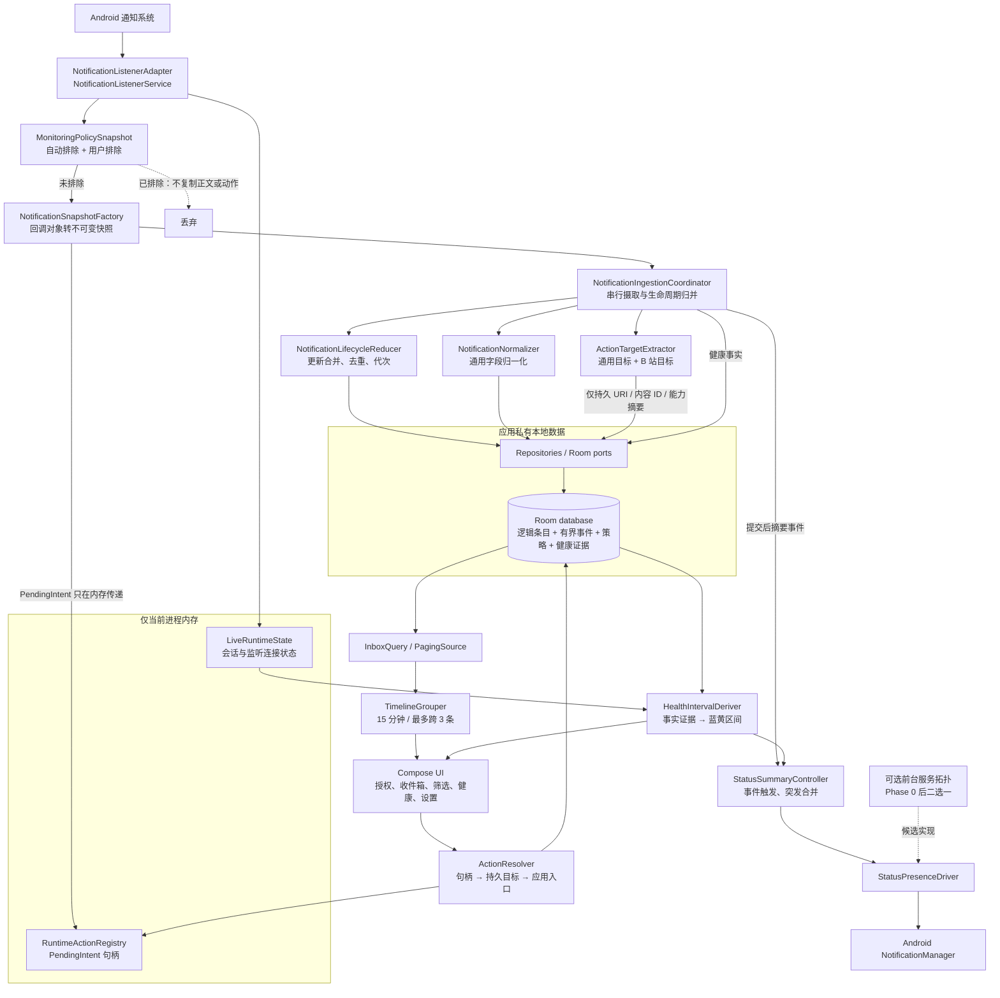
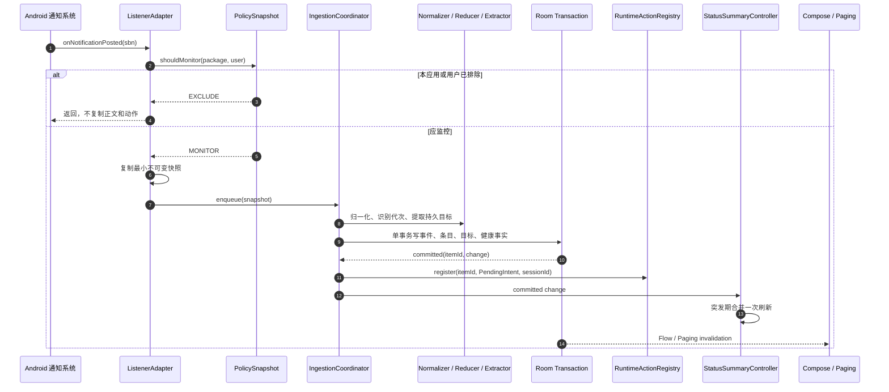
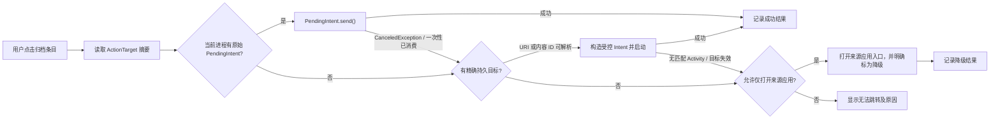
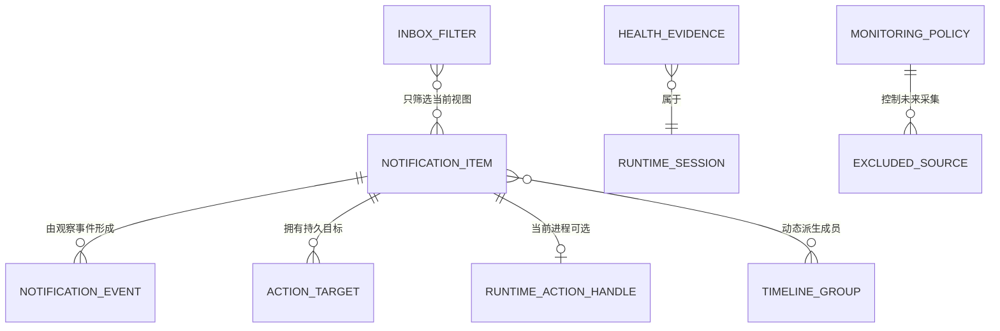

# 救救我的通知！架构设计

状态：`[已确认] plan-v1.0 逻辑架构基线；物理实现参数待 Phase 0 验证`
计划版本：`plan-v1.0`
编制日期：2026-08-17（Asia/Shanghai）
适用范围：Phase 0 技术验证、Phase 1 通知收件箱 MVP、Phase 2 日用可靠性

本文把 [`../项目计划书.md`](../项目计划书.md) 中已经确认的产品边界展开为可实施的逻辑架构。本文中的领域模型、接口和目录是实现契约，不是已经锁定的 Room 表、列或迁移方案。

## 1. 架构结论与边界

- `[已确认]` v0 使用原生 Kotlin、Jetpack Compose、Material 3、Room 和 `NotificationListenerService`，只支持 Android 16 及以上，`applicationId` 为 `io.github.prince_dulb.ohmynotification`。
- `[候选]` Phase 0 至 Phase 2 先采用单个 Android 应用模块 `:app`，在包内按平台适配、领域、数据、用例和界面分层。现阶段拆成多个 Gradle 模块只会增加构建和依赖管理成本，尚无第二个真实后台功能证明其必要性。
- `[候选]` 模块间依赖遵循“平台和界面依赖用例，用例依赖领域端口，数据层实现领域端口”的单向关系；Android 回调对象不得穿透到数据库和 Compose 界面。
- `[候选]` 以一个串行通知写入协调器维护通知生命周期顺序；每次真实回调只做一次必要的持久化事务，事务成功后才刷新状态摘要和界面数据流。
- `[候选]` UI 不直接读取 `NotificationListenerService` 的内存状态，服务也不直接持有 Activity、ViewModel 或 Compose 状态。Room 中的事实和当前进程内可验证的运行状态是两者之间的边界。
- `[待验证]` 常驻状态通知最终采用“监听服务直接维护普通常驻通知”还是“独立前台服务承载通知”。架构通过 `StatusPresenceDriver` 隔离两种拓扑，在真机 A/B 和平台规则核对完成前不锁定实现。
- `[候选]` 跳转采用双轨模型：进程存活期间使用原始 `PendingIntent` 内存句柄；可提取时同时保存 URI、内容 ID 等持久目标。二者都不可用时才降级为打开来源应用或明确报告无法跳转。
- `[排除]` 不把 `PendingIntent`、`Parcel` 字节、原始 `Intent` 或其他 Binder 令牌写入 Room、文件、日志或诊断导出。
- `[排除]` v0 不建立通用“宿主 + 模块”框架，不使用无限循环、轮询、精确闹钟、唤醒锁或单一前台服务承载未来所有任务。
- `[已确认]` 未经 Phase 0 证实的 Android 行为、阈值和资源预算都保持 `[待验证]`，不得以架构图代替真机证据。

## 2. 整体架构



### 2.1 运行拓扑

| 拓扑 | 状态 | 结构 | 使用条件 |
|---|---|---|---|
| 监听服务直接维护状态通知 | `[待验证]` | `NotificationListenerService` 在连接、真实通知或摘要变化后调用 `StatusPresenceDriver` | 若红魔 11 Pro+ 长待机可靠、通知存在语义可接受且资源占用最低，则优先采用 |
| 独立前台服务维护状态通知 | `[待验证]` | 监听服务把已提交摘要交给前台服务；前台服务不运行循环 | 只有在 A/B 证明其显著改善可靠性或才能满足“通知存在即正在运行”的用户语义，并确认合法 foreground service type 后采用 |
| 两套拓扑同时常驻 | `[排除]` | 同时保留普通常驻通知和独立前台服务 | 重复通知、重复生命周期和无必要资源成本 |

`[已确认]` 无论选择哪种拓扑，通知使用权、`POST_NOTIFICATIONS`、状态通知渠道、监听连接和最近正面运行证据都必须分别显示；一条残留通知不能覆盖其他健康事实。

## 3. 组件职责与依赖

| 组件 | 状态 | 单一职责 | 输入 | 输出或端口 | 允许依赖 |
|---|---|---|---|---|---|
| `NotificationListenerAdapter` | `[候选]` | 接收 Android 监听连接、发布或更新、移除和补扫事件 | `StatusBarNotification`、移除原因、监听生命周期 | 不可变 `NotificationSnapshot`、连接事实 | Android framework、`MonitoringPolicySnapshot`、快照工厂 |
| `MonitoringPolicySnapshot` | `[候选]` | 在回调热路径以进程内只读集合判断自动排除和用户排除 | 包名、Android 用户 | `MONITOR` 或 `EXCLUDE` | `MonitoringPolicyRepository`；不得依赖 UI 筛选 |
| `NotificationSnapshotFactory` | `[候选]` | 在回调边界复制必要字段，防止 framework 对象跨线程传播 | framework 通知对象 | 通用字段、系统身份、时间、动作能力、内存动作句柄 | Android framework；不得访问数据库 |
| `NotificationIngestionCoordinator` | `[候选]` | 按观察顺序串行处理快照并建立事务边界 | `NotificationSnapshot` | 已提交的 `ItemChange` 和健康事实 | 归一化器、生命周期归并器、目标提取器、仓储端口 |
| `NotificationNormalizer` | `[候选]` | 把各应用不一致的标题、正文和来源字段归一化 | 快照中的可见字段 | `NormalizedContent` | 纯 Kotlin 领域规则 |
| `NotificationLifecycleReducer` | `[候选]` | 依据系统身份、当前代次和事件序列决定新建、更新、移除或补扫归并 | 快照、当前活动条目摘要 | `CreateItem`、`UpdateItem`、`CloseLifecycle` 或 `NoContentChange` | 纯 Kotlin 领域模型 |
| `ActionTargetExtractor` | `[候选]` | 识别可持久化的通用目标和来源专用目标 | 归一化快照 | 有优先级的 `ActionTarget` 候选 | 通用规则、可插拔来源提取器 |
| `BilibiliTargetExtractor` | `[待验证]` | 从投稿、动态、开播通知中提取稳定 URI 或内容 ID | B 站真实通知样本 | 精确目标或“未识别” | 只依赖纯数据快照；不得登录、联网或调用私有 API |
| `RuntimeActionRegistry` | `[待验证]` | 在当前进程内按条目保存原始 `PendingIntent` 引用并记录尝试结果 | 条目 ID、动作句柄、进程会话 ID | 当前可用句柄 | 仅内存；不得被 Room、日志或导出层依赖 |
| `ActionResolver` | `[候选]` | 按明确优先级选择并执行跳转，向用户报告真实结果 | 条目 ID | 成功、取消、无匹配应用、无目标等结果 | 内存句柄端口、持久目标仓储、Android 启动适配器 |
| `NotificationRepository` | `[候选]` | 保存和查询逻辑条目及有界事件 | 领域事务命令 | 条目流、分页查询、事务结果 | Room 实现；领域层只看端口 |
| `MonitoringPolicyRepository` | `[候选]` | 保存采集排除策略 | 用户排除集合 | 带修订号的热路径快照流 | Room 或应用私有设置实现；与查看筛选分离 |
| `HealthEvidenceRepository` | `[候选]` | 保存最小正面或负面健康事实 | 监听、权限、渠道、进程会话事件 | 时段查询 | Room 实现 |
| `HealthIntervalDeriver` | `[候选]` | 保守地把事实派生为已确认运行和未确认运行区间 | 健康事实、当前进程实时状态、查询范围 | `HealthInterval` 序列和各健康维度摘要 | 纯 Kotlin 规则 |
| `InboxQuery` | `[候选]` | 按稳定顺序分页读取当前查看范围 | `InboxFilter` | 有序 `NotificationItem` 窗口 | Room 查询端口；不得修改监控策略 |
| `TimelineGrouper` | `[候选]` | 把有序条目增量派生为单条或应用抽屉 | 有序条目窗口、分组参数 | `TimelineNode` | 纯 Kotlin；不得写回事实表 |
| `StatusSummaryController` | `[候选]` | 根据提交后事件构造低打扰状态摘要并合并突发刷新 | `ItemChange`、健康摘要、锁屏隐私规则 | `StatusNotificationModel` | `StatusPresenceDriver`；不得轮询数据库 |
| `StatusPresenceDriver` | `[候选]` | 隔离普通通知和前台服务两种系统实现 | 状态通知模型 | Android 状态通知 | Android framework |
| Compose features | `[候选]` | 提供首次授权、收件箱、筛选、健康状态和设置体验 | 用例状态流 | 用户意图 | 用例层；不得直连 Room、监听服务或 `PendingIntent` |

### 3.1 依赖规则

1. `[候选]` `domain` 只包含纯 Kotlin 模型、规则和端口，不引用 Android、Room、Compose 或具体来源应用。
2. `[候选]` `platform` 把 Android 回调和启动行为翻译成领域输入或输出，不承载合并、排序、分组和健康派生规则。
3. `[候选]` `data` 实现领域仓储；DAO、Room entity 和迁移对象不得暴露给界面或监听服务。
4. `[候选]` `feature` 只通过用例或查询端口取数。监控排除和查看筛选使用不同用例、不同状态对象和不同持久化键。
5. `[候选]` 来源专用提取器通过 `PersistentTargetExtractor` 接口接入；通用通知链路不得依赖 B 站包名或页面结构。
6. `[候选]` v0 使用显式构造和应用级 wiring 即可；是否引入依赖注入框架在出现明显复杂度后再评估，不为形式增加常驻对象和构建成本。

## 4. 端到端数据流

### 4.1 通知到达、归并与持久化



详细契约：

1. `[已确认]` 本应用包名始终自动排除；用户排除策略在读取标题、正文和动作前生效。Android 系统仍会把回调交给监听服务，但 OMN 不为已排除来源建立通知条目、事件正文或动作记录。
2. `[候选]` 排除策略每次提交生成递增 `policyRevision`。界面只在策略持久化并发布新的原子内存快照后显示修改成功；回调同时捕获决策修订号。修改成功前已经按旧修订接纳的回调仍按原决策提交，修改成功后的回调必须使用新修订，从而给“只影响后续采集”一个确定边界。
3. `[候选]` 回调适配器只复制归并和展示所需字段，并记录两个时间：来源 `postTime` 与本机实际接收 UTC 时间。framework 对象、`Bundle` 和 `StatusBarNotification` 不跨越回调边界。
4. `[候选]` 摄取协调器为每个观察分配稳定 `ingestSequence`，在单写者中保持 OMN 实际观察顺序；不能用设备壁钟的唯一性代替顺序。
5. `[候选]` 生命周期归并先用 Android 用户、来源包名和系统身份定位活动代次；内容指纹只作更新判断和诊断证据，不得单独决定两个通知是同一条。
6. `[候选]` 同一活动代次的内容变化更新现有 `NotificationItem`，保持 `firstReceivedAt` 和排序键不变，只更新 `lastUpdatedAt`、内容修订和动作能力。
7. `[候选]` 一个 Room 事务原子完成：最小诊断事件写入、条目新建或更新、持久目标替换或补充、通知回调健康证据写入。任何一步失败时，本次逻辑变化整体不提交。
8. `[候选]` 原始 `PendingIntent` 不进入事务；事务提交返回条目 ID 后才注册到当前进程内存。若进程在提交后、注册前终止，条目仍然可靠存在，但只剩持久目标或明确的“运行时动作不可用”状态。
9. `[候选]` 状态通知摘要只消费已提交的 `ItemChange`，因此“已记录 N 条”不领先于数据库事实。突发合并窗口的具体时长由 Phase 0 测量锁定。
10. `[候选]` Room 提交使分页数据流失效；界面增量读取新窗口并运行分组器，不由监听服务主动推送完整列表。

### 4.2 更新、移除与重连补扫

- `[候选]` Android 的 `onNotificationPosted` 同时可能代表新发布和已有通知更新；`NotificationLifecycleReducer` 根据活动身份和代次将其归类为 `POSTED` 或 `UPDATED`。
- `[候选]` `onNotificationRemoved` 关闭当前活动代次并记录移除原因，不删除长期条目，也不因为系统通知被划除而删除动作目标。
- `[候选]` 系统身份已经关闭后再次出现时创建新代次；不能仅因 `key`、`id` 或 `tag` 相同就复用旧条目。具体 key 复用反例由 Phase 0 样本锁定。
- `[候选]` 监听重连后调用系统允许的活动通知快照进行补扫；补扫只恢复仍处于活动状态的通知，不能声称找回断连期间已出现又消失的通知。
- `[候选]` 补扫事件经过同一归并器和同一事务，事件类型标为 `RECOVERY_SNAPSHOT`，不得为已存在的活动代次制造重复条目。
- `[已确认]` 移除、重连和补扫不会改变旧条目的 `firstReceivedAt`，因此不会把历史条目顶到列表顶部。

### 4.3 列表展示

1. `[已确认]` `InboxFilter` 只改变查询范围，不改变 `MonitoringPolicy`。
2. `[已确认]` 基础有序流按 `firstReceivedAt DESC` 排列；相同接收时间使用稳定、持久的次级顺序。`[候选]` 次级顺序为 `ingestSequence DESC`，最终再以不变 `itemId` 保证全序。
3. `[候选]` 查询层以分页窗口返回紧凑 `NotificationItemSummary`，详情正文和诊断信息按需读取；万级记录不得一次载入内存。
4. `[候选]` `TimelineGrouper` 对当前有序结果增量派生 `SingleItemNode` 或 `AppDrawerNode`，不得改写条目时间或把抽屉当作持久事实。
5. `[已确认]` UI 使用稳定条目键和抽屉键；展开抽屉后成员仍按自己的严格时间顺序显示。

### 4.4 用户点击与跳转



- `[候选]` 跳转优先级为：当前进程原始动作 → 已验证的精确持久目标 → 来源应用入口 → 明确失败。来源应用入口不是精确成功，界面和诊断必须区分。
- `[候选]` `PendingIntent.send()` 的成功只说明系统接受本次动作，不等同于目标页面一定存在；Phase 0 端到端测试必须确认实际落页。
- `[候选]` 持久目标启动前检查 URI scheme、目标包和可解析 Activity；不得把通知正文拼成搜索词后冒充精确目标。
- `[已确认]` 条目年龄不参与动作可用性判断。动作只因实际取消、消费、目标不可解析或尝试失败改变状态。
- `[候选]` 跳转失败只更新动作尝试摘要，不修改条目首次接收时间和列表顺序。

## 5. 线程、队列与事务边界

### 5.1 执行上下文

| 边界 | 状态 | 约束 |
|---|---|---|
| Android 监听回调 | `[候选]` | 只做排除判断、最小字段复制和提交摄取；不运行 Room 查询、复杂 URI 解析、图标加载或 Compose 状态更新 |
| 摄取队列 | `[待验证]` | 单消费者、保持观察顺序、不得静默丢弃。容量、满载退让和进程终止前可接受窗口必须用 100 条及更高突发样本验证 |
| 数据库写入 | `[候选]` | 使用专用串行写入上下文；一个观察事件对应至多一个领域事务。密集更新可以共享调度，但不得在提交前用仅内存去抖吞掉最后状态 |
| 纯领域计算 | `[候选]` | 归一化、归并决策、分组和健康派生均为无 Android 副作用的纯函数，便于单元与性质测试 |
| Room 读取 | `[候选]` | 分页和按需详情查询在 Room 管理的后台执行器运行；主线程只收集状态流和渲染 |
| 状态通知刷新 | `[候选]` | 只在已提交条目变化、监听状态变化或必要摘要变化后调度；突发合并使用进程内短延迟，不设置系统周期任务 |
| UI | `[已确认]` | Compose 主线程只处理轻量状态和用户意图；分组大窗口、目标提取和数据库操作不得占用主线程 |

### 5.2 可靠性要求

- `[已确认]` 队列满载时不得使用 `DROP_OLDEST`、`DROP_LATEST` 或无日志的 `trySend` 失败来维持表面流畅。
- `[待验证]` Phase 0 比较“有界队列 + 明确背压”和“直接提交单线程执行器”的回调延迟、突发内存及丢失风险，再锁定容量和退让策略。
- `[候选]` 每个快照携带 `runtimeSessionId`、`listenerConnectionId` 和 `observedAt`；事务中的 `ingestSequence` 决定本应用观察顺序。
- `[候选]` 如果数据库事务失败，记录不含正文和动作的本地故障计数，并让状态页报告采集异常；不得把失败事件显示成已成功记录。
- `[排除]` 不先在内存累计正文后定期批量落盘。进程随时可能被系统终止，低写盘不能以可避免的数据丢失换取。
- `[候选]` 允许在同一事务内合并同一活动通知的连续更新，但前提是 Phase 0 证明最终内容、首次时间、动作和诊断序列均不丢失；否则逐观察提交。

## 6. 关键领域模型

`[已确认]` 下列字段是逻辑语义，类型为跨层契约；它们不规定 Room 表名、主键物理类型、索引、外键、TypeConverter 或迁移版本。Phase 0 样本和查询基准完成后，另行编写 schema 规格并触发数据库变更审批。

### 6.1 标识与快照

#### `NotificationIdentity`

| 字段 | 逻辑类型 | 状态 | 语义与约束 |
|---|---|---|---|
| `sourcePackage` | `PackageName` | `[已确认]` | 来源包名；非空 |
| `sourceUser` | `AndroidUserRef` | `[已确认]` | 区分 Android 用户或工作资料；不得只用包名归并 |
| `systemKey` | `String` | `[已确认]` | 系统活动通知 key；仅是重要身份信号，不承诺跨重启永久唯一 |
| `notificationId` | `Int` | `[已确认]` | 来源应用提供的通知 ID |
| `tag` | `String?` | `[已确认]` | 可空；与 ID、用户、包名共同作为反例检查信号 |
| `lifecycleGeneration` | `NonNegativeInt?` | `[候选]` | 回调快照中为空；归并后必须赋值。OMN 为 key 关闭后再出现分配新代次，防止复用旧条目 |

#### `NotificationSnapshot`（仅摄取过程）

| 字段 | 逻辑类型 | 状态 | 语义与约束 |
|---|---|---|---|
| `runtimeSessionId` | `RuntimeSessionId` | `[候选]` | 每次进程启动新建，不跨进程复用 |
| `listenerConnectionId` | `ConnectionId` | `[候选]` | 每次监听连接新建，重连即变化 |
| `callbackKind` | `ObservedCallbackKind` | `[候选]` | `POST_OR_UPDATE`、`REMOVED`、`RECOVERY_SNAPSHOT` |
| `identity` | `NotificationIdentity` | `[已确认]` | 回调快照不含 OMN 代次，`lifecycleGeneration` 为空并由归并器补齐 |
| `postTime` | `InstantUtc` | `[已确认]` | 来源通知发布时间；不能作为唯一接收或排序事实 |
| `observedAt` | `InstantUtc` | `[已确认]` | OMN 收到回调的壁钟 UTC 时间 |
| `observedElapsed` | `MonotonicTime` | `[候选]` | 同一进程内处理时钟跳变和先后顺序；不跨重启比较 |
| `content` | `RawVisibleContent` | `[候选]` | 标题、正文、子文本等必要字段副本；不复制图片和无关 extras |
| `actionCapabilities` | `ActionCapabilitySet` | `[候选]` | 是否观察到内容动作、通知动作和可解析持久候选的摘要 |
| `runtimeAction` | `PendingIntent?` | `[待验证]` | 仅在当前进程内传递；不得持久化或输出日志 |
| `policyRevision` | `StableSequence` | `[候选]` | 回调做排除决策时使用的策略修订号，定义策略并发边界 |

### 6.2 长期条目与有界事件

#### `NotificationEvent`

| 字段 | 逻辑类型 | 状态 | 语义与约束 |
|---|---|---|---|
| `eventId` | `EventId` | `[候选]` | 不变内部标识 |
| `itemId` | `ItemId?` | `[候选]` | 关联逻辑条目；先见移除等异常观察允许为空 |
| `identity` | `NotificationIdentity` | `[已确认]` | 系统身份与非空 OMN 代次 |
| `eventKind` | `NotificationEventKind` | `[候选]` | `POSTED`、`UPDATED`、`REMOVED`、`RECOVERY_SNAPSHOT` |
| `postTime` | `InstantUtc?` | `[已确认]` | 来源时间；移除事件可能沿用已知值或为空 |
| `observedAt` | `InstantUtc` | `[已确认]` | 本机接收时间 |
| `ingestSequence` | `StableSequence` | `[候选]` | 本应用提交顺序；同一安装内单调递增 |
| `contentFingerprint` | `OpaqueFingerprint?` | `[候选]` | 只判断内容是否变化或构造反例，不保存第二份正文，也不单独用于去重 |
| `actionSummary` | `ActionCapabilitySet` | `[候选]` | 只保存能力位，不保存令牌和完整目标 |
| `removalReason` | `RemovalReason?` | `[候选]` | 系统提供时保存枚举摘要 |
| `runtimeSessionId` | `RuntimeSessionId` | `[候选]` | 关联健康证据和调试观察顺序 |
| `retentionOrder` | `StableSequence` | `[候选]` | 供容量上限裁剪诊断事件；具体容量或期限由 Phase 0 锁定 |

#### `NotificationItem`

| 字段 | 逻辑类型 | 状态 | 语义与约束 |
|---|---|---|---|
| `itemId` | `ItemId` | `[已确认]` | 不变逻辑条目标识 |
| `identity` | `NotificationIdentity` | `[已确认]` | 当前系统身份和非空生命周期代次 |
| `sourcePackage` | `PackageName` | `[已确认]` | 图标按包名受控缓存，不在每条记录重复保存位图 |
| `sourceUser` | `AndroidUserRef` | `[已确认]` | 与包名共同区分来源 |
| `sourceLabelSnapshot` | `String?` | `[候选]` | 卸载或改名后仍可识别历史来源；不是归并键 |
| `title` | `String?` | `[已确认]` | 归一化标题；缺失必须被支持 |
| `body` | `String?` | `[已确认]` | 归一化正文；缺失必须被支持 |
| `firstReceivedAt` | `InstantUtc` | `[已确认]` | 首次观察时间；一旦创建不得因更新改变 |
| `lastUpdatedAt` | `InstantUtc` | `[已确认]` | 最近内容或动作变化时间，不参与默认主排序 |
| `originalPostTime` | `InstantUtc?` | `[候选]` | 来源声明时间，供详情和诊断，不替代首次接收时间 |
| `ingestSequence` | `StableSequence` | `[候选]` | 创建时分配且不变，作为时间相同时的次级顺序 |
| `contentRevision` | `NonNegativeInt` | `[候选]` | 实质内容变化时递增，重复回调不递增 |
| `lifecycleState` | `NotificationLifecycleState` | `[候选]` | `ACTIVE`、`REMOVED`、`UNKNOWN`；移除不等于删除条目 |
| `actionState` | `ActionStateSummary` | `[候选]` | 当前有哪些运行时或持久策略、最近一次尝试结果 |

`[排除]` `NotificationItem` 不含已读、未读、待办或自动归档字段；也不默认保存大图、媒体和逐条应用图标。

### 6.3 跳转模型

#### `ActionTarget`（可持久）

| 字段 | 逻辑类型 | 状态 | 语义与约束 |
|---|---|---|---|
| `targetId` | `TargetId` | `[候选]` | 不变内部标识 |
| `itemId` | `ItemId` | `[已确认]` | 一个条目可有多个按优先级排列的目标 |
| `kind` | `PersistentTargetKind` | `[候选]` | `EXACT_URI`、`SOURCE_CONTENT_ID`、`APP_LAUNCH`；不含 `PendingIntent` |
| `provider` | `String?` | `[候选]` | 例如 `bilibili`；通用目标可为空 |
| `payload` | `ValidatedTargetPayload` | `[待验证]` | 规范化 URI 或内容类型 + ID；不得是任意序列化 `Intent` |
| `priority` | `Int` | `[候选]` | 同一条目的确定执行顺序 |
| `validationState` | `TargetValidationState` | `[候选]` | `UNTESTED`、`USABLE`、`TEMPORARY_FAILURE`、`PERMANENT_FAILURE` |
| `lastAttemptAt` | `InstantUtc?` | `[候选]` | 仅实际点击时更新；不运行后台探测 |
| `lastFailureReason` | `ActionFailureReason?` | `[候选]` | 不包含正文、URI 查询参数和令牌等敏感内容 |

#### `RuntimeActionHandle`（不可持久）

| 字段 | 逻辑类型 | 状态 | 语义与约束 |
|---|---|---|---|
| `itemId` | `ItemId` | `[候选]` | 与已提交条目关联 |
| `pendingIntent` | `PendingIntent` | `[已确认]` | 只存在当前进程内存 |
| `role` | `RuntimeActionRole` | `[候选]` | `CONTENT` 或经 Phase 0 认可的其他动作角色 |
| `capturedAt` | `InstantUtc` | `[候选]` | 仅诊断句柄年龄，不构成人为 TTL |
| `runtimeSessionId` | `RuntimeSessionId` | `[候选]` | 进程重建后旧句柄必然不可访问 |
| `lastAttempt` | `RuntimeAttemptResult?` | `[候选]` | 成功、取消或一次性已消费等进程内状态 |

### 6.4 策略、健康和时间轴模型

#### `MonitoringPolicy`

| 字段 | 逻辑类型 | 状态 | 语义与约束 |
|---|---|---|---|
| `alwaysExcludedPackages` | `Set<PackageName>` | `[已确认]` | 至少包含 OMN 自身包名，用户不可取消 |
| `userExcludedSources` | `Set<AppUserKey>` | `[已确认]` | 只影响策略生效后的新回调 |
| `changedAt` | `InstantUtc` | `[候选]` | 用于诊断规则何时生效 |
| `revision` | `StableSequence` | `[候选]` | 每次成功修改递增；持久值与热路径快照必须一致 |

#### `InboxFilter`

| 字段 | 逻辑类型 | 状态 | 语义与约束 |
|---|---|---|---|
| `includedSources` | `Set<AppUserKey>` | `[已确认]` | 非空时只查看这些来源；可多选 |
| `excludedSources` | `Set<AppUserKey>` | `[已确认]` | 白名单为空时隐藏这些来源；用于抽屉“不查看此 App”快捷操作 |
| `timeRange` | `ClosedRange<InstantUtc>?` | `[候选]` | v0 基础查询可为空；关键词与时间筛选属于 `[B]` |

`[已确认]` `InboxFilter` 与 `MonitoringPolicy` 没有写入依赖，不能复用一个布尔字段或同一组“选中的应用”。

#### `HealthEvidence`

| 字段 | 逻辑类型 | 状态 | 语义与约束 |
|---|---|---|---|
| `evidenceId` | `EvidenceId` | `[候选]` | 不变内部标识 |
| `runtimeSessionId` | `RuntimeSessionId` | `[候选]` | 每个进程会话唯一 |
| `listenerConnectionId` | `ConnectionId?` | `[候选]` | 监听相关证据必填；权限或渠道观察可为空 |
| `kind` | `HealthEvidenceKind` | `[候选]` | 见枚举表 |
| `occurredAt` | `InstantUtc` | `[已确认]` | UTC 壁钟时间 |
| `occurredElapsed` | `MonotonicTime?` | `[候选]` | 同一进程内抵抗壁钟跳变 |
| `facet` | `HealthFacet` | `[候选]` | `LISTENER`、`LISTENER_ACCESS`、`STATUS_PERMISSION`、`STATUS_CHANNEL`、`PROCESS` |
| `value` | `HealthFactValue` | `[候选]` | 离散事实，不保存通知正文 |

#### `HealthInterval`（派生，不是原始事实）

| 字段 | 逻辑类型 | 状态 | 语义与约束 |
|---|---|---|---|
| `start` / `end` | `InstantUtc` | `[已确认]` | 查询范围内半开区间；界面按设备时区显示 |
| `state` | `HealthIntervalState` | `[已确认]` | `CONFIRMED_RUNNING` 或 `UNCONFIRMED` |
| `evidenceRefs` | `List<EvidenceId>` | `[候选]` | 解释区间来源；诊断视图按需加载 |
| `isLiveProjection` | `Boolean` | `[候选]` | 当前进程内实时状态投影，不冒充已经持久化的历史事实 |

#### `TimelineNode`（派生，不持久）

| 变体 | 字段 | 状态 | 约束 |
|---|---|---|---|
| `SingleItemNode` | `itemId`、时间、来源 | `[已确认]` | 保持基础全序位置 |
| `AppDrawerNode` | `groupId`、来源、成员 ID、最新/最早时间、数量、策略版本 | `[已确认]` | 至少两个成员；成员同一来源；展开状态仅属于 UI |

### 6.5 枚举契约

| 枚举 | 值 | 状态与说明 |
|---|---|---|
| `ObservedCallbackKind` | `POST_OR_UPDATE`、`REMOVED`、`RECOVERY_SNAPSHOT` | `[候选]` 回调边界的事实，不提前猜新发还是更新 |
| `NotificationEventKind` | `POSTED`、`UPDATED`、`REMOVED`、`RECOVERY_SNAPSHOT` | `[候选]` 归并器输出 |
| `NotificationLifecycleState` | `ACTIVE`、`REMOVED`、`UNKNOWN` | `[候选]` 不等于用户删除状态 |
| `PersistentTargetKind` | `EXACT_URI`、`SOURCE_CONTENT_ID`、`APP_LAUNCH` | `[候选]` 只有受支持的结构化目标；不允许 `SERIALIZED_INTENT` |
| `ActionFailureReason` | `CANCELED`、`CONSUMED`、`NO_HANDLER`、`TARGET_MISSING`、`UNSUPPORTED`、`SECURITY_REJECTED`、`UNKNOWN_FAILURE` | `[候选]` UI 映射为可理解文案，公开诊断只输出枚举 |
| `HealthEvidenceKind` | `PROCESS_STARTED`、`LISTENER_CONNECTED`、`LISTENER_DISCONNECTED`、`NOTIFICATION_CALLBACK`、`RECOVERY_COMPLETED`、`ACCESS_OBSERVED`、`STATUS_PERMISSION_OBSERVED`、`STATUS_CHANNEL_OBSERVED`、`NORMAL_STOP` | `[候选]` 只记录实际观察，不编造“被杀时刻” |
| `HealthIntervalState` | `CONFIRMED_RUNNING`、`UNCONFIRMED` | `[已确认]` 不增加没有证据的 `STOPPED` 状态 |

### 6.6 关系与全局不变量



- `[已确认]` 一个逻辑通知条目可以关联多个系统观察事件；系统更新不得无条件创建新条目。
- `[已确认]` 一个条目可以有零个或多个持久动作目标，同时至多有一个当前首选运行时内容动作句柄。
- `[已确认]` 诊断事件有界，条目默认长期保存；清理事件不得级联删除通知条目。
- `[已确认]` 抽屉只是对条目的派生视图，折叠、展开或算法升级不修改通知事实。
- `[已确认]` 用户加入排除列表不会删除既有条目；查看筛选不影响任何采集和持久化路径。
- `[候选]` 对同一 `sourceUser + sourcePackage + systemKey + lifecycleGeneration` 同时最多存在一个活动条目；该约束在 Phase 0 key 复用样本后确认。
- `[已确认]` `firstReceivedAt`、创建时 `ingestSequence` 和 `itemId` 在条目生命周期内不可变。

## 7. `PendingIntent` 与持久目标边界

### 7.1 能承诺与不能承诺的事情

- `[已确认]` OMN 不按天数人为让动作过期；条目存在时持续保留所有通过受支持方式获得的动作能力。
- `[已确认]` 原始 `PendingIntent` 是系统维护的运行时令牌。创建方进程死亡不必然取消它，但创建方可取消、可设置一次性，创建方进入 stopped 状态等系统行为也可能使其失效。
- `[已确认]` `PendingIntent` 没有受支持的 Room 或文件持久化格式；`Parcel` 是 IPC 格式，不是长期磁盘序列化协议。
- `[已确认]` 因此“内存里不主动删除引用”不能升级为“重启后或永久一定可跳转”的承诺。
- `[待验证]` Phase 0 必须测量长期持有大量运行时句柄的内存和系统资源成本，并比较直接引用、受支持的有限系统托管方式及持久目标提取。没有证据前不实施静默 LRU 淘汰，也不承诺无限持有。

### 7.2 两条动作轨道

| 轨道 | 保存位置 | 生命周期 | 优点 | 失败边界 |
|---|---|---|---|---|
| 原始运行时动作 | `[待验证]` `RuntimeActionRegistry` 内存 | 最长到当前进程结束，且可能更早被创建方取消或消费 | 最接近原通知点击语义 | 进程重建、一次性动作、创建方取消、stopped 状态、系统回收 |
| 结构化持久目标 | `[待验证]` Room 中的 `ActionTarget` | 随条目保存，直至用户删除或目标被实际判定失效 | 可跨 OMN 进程重建和手机重启 | 来源未提供稳定 URI/ID、页面被删除、客户端路由变化、无处理 Activity |

`[候选]` B 站提取器只输出结构化类型，例如“投稿 + BV/AV 标识”“动态 + 动态 ID”“直播间 + room ID”或经验证的官方 URI；不保存通知正文搜索词作为精确目标，也不依赖 B 站登录态、网络 API 或页面抓取。

### 7.3 失败状态

- `[候选]` 运行时句柄因 `CanceledException` 失败后标为当前进程不可用，并立即尝试下一级持久目标。
- `[候选]` 一次性句柄成功使用后标为已消费；同一条目的持久目标仍可继续存在。
- `[候选]` URI 无处理程序或目标内容不存在时记录分类结果，界面展示“精确跳转不可用”；只有用户选择或产品规格允许时才执行“仅打开来源应用”。
- `[已确认]` 所有失败都必须可见，不允许捕获异常后伪装为打开成功。

## 8. 健康证据与蓝黄区间派生

### 8.1 分离五个健康维度

| 维度 | 状态 | 事实来源 | 对用户的意义 |
|---|---|---|---|
| 进程会话 | `[候选]` | 进程启动、当前内存会话、正常停止 | OMN 当前进程是否可被正面观察 |
| 监听连接 | `[已确认]` | `onListenerConnected`、`onListenerDisconnected`、真实通知回调 | 通知监听链路是否已连接 |
| 通知使用权 | `[已确认]` | 系统授权状态读取 | 系统是否允许 OMN 作为通知监听器 |
| 状态通知权限 | `[已确认]` | `POST_NOTIFICATIONS` 运行时权限 | 应用外状态卡是否可见 |
| 状态通知渠道 | `[已确认]` | 独立渠道启用状态 | 用户是否关闭了“运行状态”渠道 |

`[已确认]` 蓝黄主时间轴表达“通知监听运行得到正面证实”的区间；`POST_NOTIFICATIONS` 或状态渠道关闭不会自动把监听区间变黄，但会在健康详情中显示“应用外状态不可见”。权限已授予也不能单独把时间轴涂蓝。

### 8.2 保守派生规则

1. `[候选]` 每次进程启动生成新的 `runtimeSessionId`；每次监听连接生成新的 `listenerConnectionId`。ID 只在当前进程内创建，写入证据后不复用。
2. `[候选]` `LISTENER_CONNECTED`、同一连接内的 `NOTIFICATION_CALLBACK` 和成功完成的活动通知补扫是正面运行证据；`LISTENER_DISCONNECTED`、明确撤销通知使用权和正常停止是明确边界。
3. `[候选]` 同一 `runtimeSessionId + listenerConnectionId` 内，两条连续正面证据之间且没有负面证据的时段派生为 `CONFIRMED_RUNNING`。同一进程会话保证中间没有经历 OMN 进程重建。
4. `[候选]` 当前进程仍存活且内存状态确认监听已连接时，可以把最后正面证据投影到“现在”为蓝色，并把区间标记为 `isLiveProjection=true`；该投影在成为历史时必须由后续证据重新裁定。
5. `[已确认]` 应用无法记录自身突然被杀的准确时刻。上一个会话最后证据到下一个会话首个证据之间统一派生为 `UNCONFIRMED`，不回填“已停止”或虚构蓝色。
6. `[候选]` 收到明确断连时蓝色在断连证据处结束，之后保持黄色，直到新的连接证据出现。
7. `[候选]` 设备壁钟在会话内倒退或跳跃时，使用单调时钟校验相对顺序；跨重启只使用 UTC 事实并显示时间调整诊断，不伪造连续区间。
8. `[已确认]` 为增加蓝条长度而运行周期心跳、唤醒锁、精确闹钟或高频 WorkManager 属于排除方案。自然通知、监听生命周期、用户打开应用和状态实际变化可以产生证据。
9. `[待验证]` Phase 0 决定是否需要一种低频、无额外唤醒的自然活跃确认，以及它能提供的历史时间精度；若做不到，界面接受更多黄色未知区间。

### 8.3 状态通知模型

- `[候选]` 状态标题来自监听连接事实，摘要来自最近一次已提交条目，累计数量来自已提交计数。
- `[候选]` 使用绝对时间或 Android 系统可自行呈现的通知时间字段，不为“2 分钟前”启动周期刷新。
- `[已确认]` 解锁时最多显示来源应用和标题；锁屏公开版本只显示 OMN 状态和来源应用，不显示原正文。
- `[已确认]` 状态通知存在不等于健康证据完整。若 Phase 0 证明普通通知可残留于进程死亡之后，卡片必须显示“最近确认时间”，或选择经验证的前台服务拓扑。

## 9. 稳定排序与时间窗应用抽屉契约

### 9.1 基础全序

- `[已确认]` 未分组事实流按 `firstReceivedAt DESC` 排序，通知更新不改变该字段。
- `[候选]` 相同时间按创建时 `ingestSequence DESC`，再按不变 `itemId DESC`，形成在分页刷新、进程重建和重复查询中一致的全序。
- `[已确认]` 来源 `postTime` 只作展示或诊断，不覆盖本应用实际接收顺序。

### 9.2 首版分组参数

| 参数 | 值 | 状态 | 精确定义 |
|---|---|---|---|
| `window` | 15 分钟 | `[已确认]` | 组内最新成员与候选最旧成员的 `firstReceivedAt` 差值不得超过该值 |
| `maxInterveningOtherItems` | 3 | `[已确认]` | 从锚点向旧方向扫描时，最多跨过 3 条不同来源的可见条目；按条数而非不同应用数量计 |
| `minimumGroupSize` | 2 | `[已确认]` | “多条通知”至少为两条；不足两条保持单条 |
| `groupingKey` | `sourceUser + sourcePackage` | `[候选]` | 同包名但不同 Android 用户不混组 |
| `strategyVersion` | 初始版本标识 | `[候选]` | 算法调整后生成新组键，旧条目事实不迁移 |

### 9.3 确定性算法

`[候选]` 首版采用锚点式、非重叠分组，契约如下：

1. 从当前查询结果的严格倒序流中取第一条尚未消费的记录作为锚点。
2. 向较旧方向扫描。遇到同一 `groupingKey` 的记录时，若它与锚点跨度不超过 15 分钟且此前跨过的其他来源记录不超过 3 条，则加入候选组。
3. 遇到其他来源记录时增加“跨越条数”；即将超过 3 条或时间跨度超过 15 分钟时停止为该锚点寻找成员。
4. 候选成员达到两条时，消费这些同来源成员并输出一个抽屉；被跨过的其他来源记录不被消费，随后仍按自己的基础顺序输出。
5. 候选成员不足两条时输出锚点单条。
6. 抽屉排序位置由最新成员决定；头部必须显示最早—最晚时间和数量，明确局部聚合跨越了时间线中的其他记录。
7. 抽屉内部始终按基础全序排列。展开只改变表现，不改变成员、其他来源记录或数据库。

示例：

| 基础顺序（新 → 旧） | 派生结果 | 原因 |
|---|---|---|
| `A10:42, B10:40, A10:35` | `A 抽屉(10:35–10:42), B10:40` | A 跨 1 条且跨度 7 分钟 |
| `A10:42, B10:40, C10:39, D10:38, E10:37, A10:35` | 保持单条基础顺序 | A 需跨 4 条，超过阈值 |
| `A10:42, B10:40, A10:20` | 保持单条基础顺序 | A 跨度 22 分钟 |
| `A10:42, A10:41, A10:40` | 一个 A 抽屉，内部严格倒序 | 同来源连续突发 |

### 9.4 筛选、分页和极端突发

- `[候选]` “跨越条数”按当前可见筛选流计算：筛选隐藏的来源不计入跨越条数。切换筛选可以改变派生抽屉，但不会改变通知事实；这样界面不会因用户看不见的条目拒绝分组。Phase 0 用多应用样本验证其可预测性，若不成立则通过计划变更调整。
- `[已确认]` 分页实现不得因页大小或页边界改变组成员。`[候选]` 分组器携带未闭合锚点状态并按时间窗向下一页有限前瞻；相同输入全序必须产生相同节点序列。
- `[待验证]` 15 分钟内单应用极端突发可能包含大量成员。Phase 0 的万级样本决定抽屉成员是否需要独立分页或只先加载摘要；不得为了分组把整表载入内存。
- `[已确认]` 任何性能折中都不能改变条目事实和展开后的逐条时间顺序。

## 10. 持久化与查询设计

- `[已确认]` Room 是本地持久化边界，但当前只锁定“逻辑条目长期保存、诊断事件有界、策略和健康证据可查询”，不锁定 entity 数量和 schema 版本。
- `[候选]` 首要查询路径是：按首次接收时间分页、按一个或多个来源分页、按系统身份查活动代次、按条目读取动作目标、按时间范围读取健康证据。
- `[候选]` Phase 0 根据真实查询计划决定索引；预计需要覆盖稳定排序键、来源 + 排序键、活动系统身份、健康时间，但本文不把预计索引写成 schema 承诺。
- `[已确认]` 长期条目不自动删除；诊断事件和内部故障计数必须有容量或时间上限。具体上限在诊断价值和写盘增长测量后确认。
- `[已确认]` 删除条目是未来独立、明确的用户操作；排除应用、清理诊断事件和切换查看筛选都不得级联删除长期条目。
- `[候选]` 应用标签可保存小型文本快照；图标按包名从系统加载并使用有界内存缓存，不在每条记录写 BLOB。
- `[排除]` 默认保存通知大图、逐条位图、完整 extras、原始 `Intent`、`PendingIntent` 或第二份通知正文事件副本。
- `[候选]` 数据库统计和存储占用按用户打开设置页或真实维护事件时计算，不建立周期扫描任务。

## 11. 界面状态边界

- `[已确认]` 首次授权页分别展示通知使用权和状态通知显示权限，不把两种设置合并为一个“已授权”。
- `[候选]` 收件箱 UI 状态由分页条目、派生时间轴节点、当前筛选和健康区间组成；这些状态通过 ViewModel 组合，不复制数据库为另一份长期缓存。
- `[已确认]` Material 3、edge-to-edge、系统 inset、预测返回、不同窗口、字体缩放和至少 48dp 触控范围为实现基线。
- `[已确认]` 健康轨道同时使用蓝色实线、黄色虚线、文本和可访问描述；颜色不是唯一信息载体。
- `[候选]` 大窗口使用列表—详情布局，小窗口使用单列表和详情导航；详情读取不能阻塞列表分页。
- `[已确认]` 跳转不可用、权限被撤销、监听未连接、状态通知权限关闭和渠道关闭都有独立文案与系统设置入口，不以空列表或颜色变化暗示。

## 12. 目录结构约定

`[候选]` 详细计划获用户确认后再创建 Android 工程。v0 的物理结构保持一个 `:app`，包结构如下；测试目录镜像生产包，不建立通用宿主模块：

```text
app/
└─ src/
   ├─ main/
   │  └─ java/io/github/prince_dulb/ohmynotification/
   │     ├─ app/                 # Application、Activity、导航、对象 wiring
   │     ├─ platform/
   │     │  ├─ notification/    # NotificationListenerService 与快照适配
   │     │  ├─ status/          # 状态通知及候选前台服务驱动
   │     │  ├─ launch/          # Intent / PendingIntent 执行适配
   │     │  └─ permissions/     # 系统权限、渠道与设置入口
   │     ├─ domain/
   │     │  ├─ model/           # 本文领域模型与枚举
   │     │  ├─ port/            # 仓储、动作、状态存在等接口
   │     │  └─ rule/            # 归一化、归并、排序、分组、健康派生
   │     ├─ data/
   │     │  ├─ local/           # Room database、entity、DAO、映射
   │     │  └─ repository/      # 领域端口实现
   │     ├─ runtime/
   │     │  ├─ ingest/          # 摄取协调器、队列和会话状态
   │     │  └─ action/          # 仅内存 RuntimeActionRegistry
   │     ├─ integration/
   │     │  └─ bilibili/        # 经 Phase 0 证实的持久目标提取器
   │     ├─ feature/
   │     │  ├─ onboarding/      # 首次授权
   │     │  ├─ inbox/           # 时间轴、抽屉、详情
   │     │  ├─ filter/          # 多应用查看筛选
   │     │  ├─ health/          # 健康状态和证据说明
   │     │  └─ settings/        # 排除列表、存储与设置
   │     └─ core/               # 时间、调度器、结果类型等极小公共能力
   ├─ test/                     # 纯领域、仓储和 ViewModel 单元/性质测试
   └─ androidTest/              # Room、系统适配、Compose 与设备测试
```

目录规则：

- `[候选]` `feature` 之间不直接引用实现，只共享领域模型或显式用例。
- `[候选]` `core` 只有出现两个以上真实消费者时才接收公共代码，禁止成为杂物目录。
- `[候选]` `integration/bilibili` 只负责从纯快照提取目标，不接触 UI、Room、网络和登录状态。
- `[候选]` 若出现第二个真实后台模块，再根据依赖和构建数据评估拆出 `:core:*`、`:feature:*` 或独立模块；拆分前先更新项目规则和架构决策。
- `[已确认]` 任何真机通知样本、动作令牌、未脱敏截图、本机 SDK 路径和签名材料都不进入上述目录或 Git。

## 13. 后续后台需求的扩展边界

- `[已确认]` 通知收件箱先完成自己的闭环，未来扩展不得迫使它依赖一个永远运行的通用线程。
- `[候选]` 可复用边界限定为：权限状态描述、健康证据格式、状态摘要贡献、设置入口、受控存储和诊断结果；这些只有出现第二个消费者后才抽取。
- `[候选]` 每个新后台能力声明自己的触发模型：事件回调用平台回调，可延迟维护用 `WorkManager`，确需用户可感知连续运行时才评估前台服务。
- `[排除]` 新模块不能借用通知监听回调轮询无关工作，也不能仅为共享一条状态通知把所有逻辑塞进同一 Service。
- `[待验证]` 若未来确有多个后台模块，再设计 `BackgroundCapability`、模块生命周期和统一状态卡聚合协议；v0 不预埋注册表、动态插件系统或多模块数据库 schema。

## 14. 隐私与安全设计

1. `[已确认]` 通知正文和跳转目标默认只保存在 Android 应用私有存储，不联网、无遥测、无远程心跳。
2. `[已确认]` v0 依赖 Android 应用沙箱和设备加密，不额外引入数据库加密或应用锁；这不降低日志、锁屏和导出的最小化要求。
3. `[已确认]` 排除判断在复制正文和动作前执行；本应用状态通知自动排除，防止递归记录。
4. `[已确认]` 日志不得包含标题、正文、完整 URI、内容 ID、`PendingIntent`、`Intent`、通知 extras、Token 或用户私有路径。故障使用枚举、计数和去标识化 ID。
5. `[候选]` 内容指纹采用每安装不透明、不可作为公开字典匹配的方案；算法与密钥存放方式在 Phase 0 安全评审后锁定。指纹只用于同一设备内比较，不导出。
6. `[已确认]` 锁屏状态通知只显示 OMN 状态和来源应用；解锁状态最多显示来源和标题，不显示完整正文。
7. `[已确认]` 测试夹具使用合成通知；公开文档、Issue、提交和性能报告不含真实通知样本。需要分析真机样本时只在本地私有测试记录中使用脱敏字段。
8. `[已确认]` 诊断导出属于 `[B]` 且必须由用户主动触发，默认只含设备与版本摘要、枚举事件、时间和计数，不含正文或可执行目标。
9. `[候选]` 持久 URI 只允许已验证的 scheme、host 和字段；展示或日志时去除可能包含令牌的查询参数。
10. `[排除]` v0 不申请网络能力来“验证”目标，也不使用 B 站账号、私有 API 或服务端转存通知。

## 15. 性能与资源设计

| 资源面 | 已确认约束 | 候选实现 | Phase 0 证据 |
|---|---|---|---|
| CPU / 唤醒 | 无通知、UI 关闭时事件驱动，不轮询、不持有唤醒锁、不用精确闹钟 | 监听回调和真实状态变化触发工作 | 8 小时息屏 CPU 时间、唤醒与耗电 |
| 写盘 | 只在真实事件或明确状态变化时写；正确性先于批处理 | 单事务归并；重复内容事件只留最小诊断 | 100 条突发的事务数、写入量和漏记 |
| 内存 | 历史记录数不能使后台内存线性增长 | 分页查询、有界图标缓存、紧凑模型 | 10,000 条历史的后台 PSS 和首屏 |
| 动作句柄 | 不得无证据无限消耗 Binder 和内存，也不得静默淘汰核心动作 | 测量直接持有、持久目标覆盖率及候选系统托管方式 | 不同句柄数量下 PSS、跳转成功率、进程重建结果 |
| 状态通知 | 只在必要变化时更新，突发必须合并 | 提交后事件合并，使用系统时间展示而非周期更新相对时间 | 100 条突发时通知刷新次数 |
| 图标 / 媒体 | 不逐条保存图标，不默认保存大图 | 包名加载 + 有界缓存 | 滚动命中率、PSS 和磁盘增长 |
| 健康轨道 | 不为补蓝条增加周期唤醒 | 会话、连接、真实回调和自然活跃证据派生 | 长待机黄蓝精度与额外唤醒 |
| 前台服务 | 只有真机证明必要且平台类型合法才使用 | `StatusPresenceDriver` 后两种拓扑二选一 | NLS 单独运行与 NLS + FGS 的漏记、PSS、CPU、耗电 |

- `[候选]` 查询和分组基准必须覆盖时间密集、应用交错和单应用极端突发，而不只覆盖均匀合成数据。
- `[已确认]` release 构建和红魔 11 Pro+ 是性能结论的唯一首要证据；debug 体感和模拟器不锁定预算。
- `[已确认]` 基线建立后，同场景 CPU、唤醒、写盘或后台内存无解释回退超过 10% 即阻止合并。
- `[待验证]` 绝对数值预算、队列容量、诊断事件上限、状态更新合并时长、图标缓存大小和抽屉极端成员策略在 Phase 0 报告后写入非功能需求。

## 16. Phase 0 技术 Spike

所有 Spike 都在红魔 11 Pro+、Android 16、release 构建上给出命令、系统状态、样本类型、时间和脱敏结果。若需新增验证记录目录，先按 `AGENTS.md` 更新目录规则；不得把真机原文或动作令牌提交到 Git。

### S0：真实通知字段与生命周期样本

- `[待验证]` 收集 B 站投稿、动态、开播三类通知，以及可控测试应用的发布、更新、移除和 ID/key 复用序列。
- `[待验证]` 输出每类通知可用的身份字段、字段缺失矩阵、更新次数、移除原因和动作能力摘要。
- 决策门：能够提出不依赖标题或正文的代次归并规则；反例不会把不同内容错误合并。

### S1：原始动作寿命与持有成本

- `[待验证]` 对同一批通知分别测试：系统通知仍在、手动划除后、OMN 进程重建后、B 站普通进程结束后、B 站强行停止后、B 站更新后、手机重启后，以及覆盖真实使用习惯的短期和长期等待后。
- `[待验证]` 记录 `PendingIntent.send()` 是否被接受、实际落页、失败分类、一次性行为、句柄数量与 PSS/Binder 资源变化。
- `[待验证]` 比较直接内存引用、Android 受支持的有限系统托管候选和不持有句柄三种对照；不得序列化 `Parcel`。
- 决策门：确定运行时句柄方案、资源上限和失败语义。若无法兼顾实际查看周期和低资源，返回产品边界决策，不静默缩短有效期。

### S2：B 站持久精确目标

- `[待验证]` 检查三类通知能否脱离原始动作提取稳定 URI、BV/AV 标识、动态 ID、直播间 ID 或其他受支持目标。
- `[待验证]` 在 OMN 进程重建和手机重启后，使用结构化目标验证实际落页；覆盖内容删除、未登录和 B 站客户端更新反例。
- 决策门：投稿、动态和开播分别得到“精确持久目标”“仅运行时精确动作”或“不支持”的证据结论，UI 能据此给出真实状态。

### S3：摄取队列、事务与归并

- `[待验证]` 用可控应用制造 100 条以上发布和密集更新，比较候选队列/执行器策略的回调耗时、最大积压、内存、事务数和漏记。
- `[待验证]` 在写入中途终止 OMN 进程，确认不会出现事件已报成功而条目缺失、半更新动作或首接收时间被覆盖。
- `[待验证]` 性质测试覆盖重复回调、同标题不同目标、同 ID/tag 不同代次、补扫重放和壁钟跳变。
- 决策门：锁定不静默丢弃的提交策略、队列容量或背压方案，以及 Room 逻辑 schema 的必要字段。

### S4：监听可靠性与红魔后台策略

- `[待验证]` 覆盖首次授权、撤销授权、监听断连/重连、长时间锁屏、系统回收、开机恢复、厂商后台限制和活动通知补扫。
- `[待验证]` 每次测试记录系统版本、设备 ABI、权限和厂商设置；模拟器只用于辅助反例，不替代真机。
- 决策门：明确可观测的漏记窗口、恢复路径和用户必须配置的系统设置；不可把无法观测的时段涂蓝。

### S5：状态通知与前台服务 A/B

- `[待验证]` 对比监听服务直接发布常驻通知与独立前台服务：通知是否残留、进程重要性、重启恢复、`POST_NOTIFICATIONS` 拒绝、渠道关闭、foreground service type 合法性、PSS、CPU 和耗电。
- `[待验证]` 核对 `specialUse` 等平台与未来分发限制，禁止伪报 `dataSync` 或无关类型。
- 决策门：两者都满足正确性时选择资源更低者；若只有前台服务满足核心语义，必须先确认合法类型和真实成本再采用。

### S6：健康证据与区间精度

- `[待验证]` 用已知时间点的连接、断连、正常停止、强制终止、进程重建、权限切换和长待机构造事实线，验证派生算法不虚构停机时刻。
- `[待验证]` 比较只用自然证据时黄色区间比例和用户可理解性；记录额外唤醒为零的证据。
- 决策门：锁定正面证据集合、当前实时投影规则和可接受精度；精度不足时接受黄色，不引入高频心跳。

### S7：排序、抽屉、筛选与分页

- `[待验证]` 覆盖短跨度 `A→B→A`、跨 4 条、超过 15 分钟、相同时间、页边界、切换多应用筛选和单应用极端突发。
- `[待验证]` 验证跨越条数按当前可见流计算时，切换单选、多选和全部应用是否可预测，并构造隐藏来源很多的反例。
- 决策门：相同输入在不同页大小下得到相同成员和顺序；展开后能逐条核对原始时间；10,000 条不全量载入。

### S8：持久化、隐私与性能基线

- `[待验证]` 运行 8 小时无通知息屏、100 条突发、10,000 条历史、持续数据库增长和状态刷新计数测试。
- `[待验证]` 检查 APK 不含 32 位专有依赖，日志、数据库诊断事件和导出候选不包含真实正文、令牌、完整 URI 或本机路径。
- 决策门：写入非功能需求中的绝对预算、诊断事件上限、缓存上限和测量命令；未达标不进入 MVP。

## 17. Phase 0 后必须锁定的架构决策

| 决策 | 当前状态 | 输入证据 | 未通过时的处理 |
|---|---|---|---|
| 通知身份、代次与更新合并规则 | `[待验证]` | S0、S3 | 调整领域模型；不得先建正式 Room schema |
| 运行时动作句柄保留策略 | `[待验证]` | S1 | 若成本或寿命不成立，回到核心跳转边界 |
| B 站三类持久目标格式 | `[待验证]` | S2 | 分类型声明能力，不用标题搜索冒充精确跳转 |
| 摄取队列、执行器和事务形态 | `[待验证]` | S3 | 以不漏记和不阻塞系统回调为共同门槛重新设计 |
| 普通状态通知或独立前台服务 | `[待验证]` | S4、S5 | 若均不满足，重新定义应用外健康承诺 |
| 健康区间派生精度 | `[待验证]` | S6 | 接受更多黄色区间，不引入高频唤醒 |
| 筛选后的抽屉可预测性与分页一致性 | `[待验证]` | S7 | 保留严格时间列表，推迟跨应用压缩 |
| Room schema、索引和诊断上限 | `[待验证]` | S0、S3、S8 | 继续 Spike，不创建迁移承诺 |
| 绝对性能预算 | `[待验证]` | S5、S8 | 不进入 Phase 1 完成声明 |

## 18. 架构完成定义

`[已确认]` 本架构在进入业务实现前必须同时满足以下条件：

- [ ] Phase 0 的九组 Spike 都有真机、release 构建和脱敏证据。
- [ ] 原始动作、持久目标和降级打开三种结果在数据与 UI 中明确分开。
- [ ] 更新、移除、补扫、系统 key 复用和进程重建不会制造重复条目或改变首次排序时间。
- [ ] 排除列表在复制正文和动作前生效；查看筛选没有任何采集副作用。
- [ ] 健康时间轴只由可解释证据派生，普通通知存在不被当作唯一运行证明。
- [ ] 抽屉算法在不同页大小下确定一致，展开后保留完整逐条时间。
- [ ] 常驻通知拓扑、Room schema、队列容量、诊断上限和绝对性能预算均由 Spike 结果锁定，而非由本文提前猜测。
- [ ] 无通知长待机不产生应用主动周期唤醒、轮询或数据库写入。
- [ ] Android 工程目录创建前，详细开发计划已获用户确认，并遵守根 `AGENTS.md` 的目录和红线约束。
